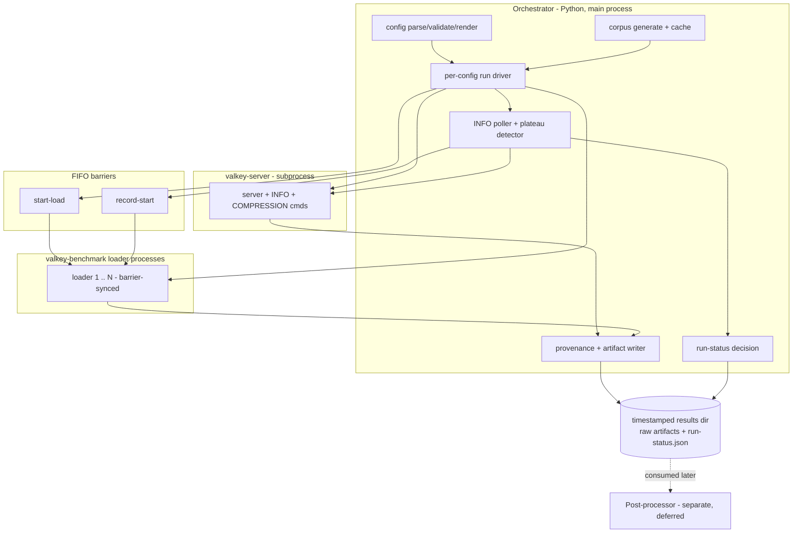

# Detailed Design — Compression Benchmark Orchestrator

_Status: proposed, v1_
_Scope: standalone benchmark orchestrator measuring the memory↔latency tradeoff of the in-tree real-time compression feature_
_Source: [`idea-honing.md`](../idea-honing.md) Q1–Q10; rendering in [`research-rendering-proposal.md`](../research-rendering-proposal.md); reuse map in [`amz-orc-findings.md`](../amz-orc-findings.md)_

---

## Table of contents

1. [Overview](#1-overview)
2. [Detailed requirements](#2-detailed-requirements)
3. [Architecture overview](#3-architecture-overview)
4. [Components and interfaces](#4-components-and-interfaces)
5. [Data models](#5-data-models)
6. [Error and failure handling](#6-error-and-failure-handling)
7. [Testing strategy](#7-testing-strategy)
8. [Appendix A — amz-orc reuse map](#appendix-a--amz-orc-reuse-map)
9. [Appendix B — valkey-benchmark modifications](#appendix-b--valkey-benchmark-modifications)
10. [Appendix C — Deferred: the post-processor](#appendix-c--deferred-the-post-processor)
11. [Appendix D — Dependencies, non-goals, v2 roadmap](#appendix-d--dependencies-non-goals-v2-roadmap)

---

## 1. Overview

### 1.1 What this is

A standalone **Python orchestrator** that measures the **memory-vs-latency tradeoff** of Valkey's in-tree real-time compression feature, by driving `valkey-benchmark` against a `valkey-server` under a set of compression configurations and collecting precise, reproducible measurements.

It is modeled on `amz_redis-benchmark-orc` (process orchestration, FIFO-barrier launch, reproducibility rigor, CPU capture) but **diverges** on three axes: it compares **compression configs at a fixed offered TPS** (open-loop), it computes **true tail percentiles by merging per-bucket histograms** (rather than averaging per-interval percentiles), and it adds the entire **memory + compressed-steady-state** dimension amz-orc lacks.

The headline artifact (rendered later by a separate post-processor) is a **Pareto chart**: X = % memory saved vs baseline, Y = % latency penalty vs baseline (per percentile), one point per compression config — everything **delta-from-baseline**.

### 1.2 Scope statement

> v1 ships the **orchestrator** (config parsing, corpus generation, server lifecycle, phased per-config runs, FIFO-barrier load, INFO polling + plateau detection, raw-artifact collection, and a success/failure verdict) plus the three **`valkey-benchmark` modifications** it depends on. The orchestrator **collects raw artifacts and decides run validity**; it does **not** reduce data or render charts. All statistical reduction (histogram merge, percentile computation, MAX `used_memory`, delta-vs-reference) and chart generation are a separate **post-processor** with its own idea-honing (Appendix C). Dict acquisition is **train-only** in v1 (import deferred).

### 1.3 Goals

- **Precision instrument.** Every number must be defensible: exact keyspace coverage, correct tail percentiles (histogram merge, not percentile averaging), worst-case memory (MAX `used_memory`), and a clean measurement window taken only at a stable compression profile.
- **Reproducible.** Same `(config, seed)` → byte-identical corpus and comparable results across runs and machines.
- **Realistic.** Measures the true equilibrium compression profile under the actual workload (hot keys uncompressed, cold compressed), not an artificial all-compressed state.
- **Delta-from-baseline.** The workload is fixed per run; every metric is reported relative to the `reference` (compression-off) config.
- **Honest about validity.** A run that cannot sustain the offered TPS, or whose compression profile does not stabilize, is reported **FAILED** — never silently measured.
- **Normal-machine runnable.** The canonical example's dataset fits a few GB so it runs on an 8–16 GB box.

### 1.4 Non-goals (v1)

See [Appendix D](#appendix-d--dependencies-non-goals-v2-roadmap). Key exclusions: chart generation and statistical reduction (→ post-processor); outlier filtering; dict **import** mode; multi-point Pareto sweeps as the shipped example (mechanism supports them; the canonical example is a 2-config before/after); non-compression benchmarking; RSS-based memory accounting; read-only (0% write) workloads.

---

## 2. Detailed requirements

Requirements are consolidated from `idea-honing.md`. Each is traceable to a Q1–Q10 decision.

### 2.1 Run model and invocation (Q1, Q2)

- **R1.1** One **run** = one `(workload, target TPS) × list of configs`, producing one timestamped **results directory**. (Q2c)
- **R1.2** Load is **open-loop, rate-limited** via `--rps`, so all configs are compared at the *same offered TPS*. (Q1, Q2)
- **R1.3** The compared axis is **compression configs** (same or different `valkey-server` build + different `--compression-*` args); the `reference` config is compression-off. (Q1, Q5)
- **R1.4** The orchestrator supports **`iterations`** repeated runs per config for statistics. (Q4)

### 2.2 Data model and corpus (Q3)

- **R2.1** The dataset is defined by `data_model`: `value_shape` (kv/json/log/coordinates), `value_size_distribution` (`constant` | `uniform:MIN:MAX` | `lognormal:μ:σ`), `value_size_min` / `value_size_max` clamps, **required `seed`**, `corpus_entries`, `key_count`, `key_distribution` (`uniform` | `zipf:θ`). (Q3)
- **R2.2** The **corpus is generated script-side** by the orchestrator from `data_model`, written to a file, and passed to `valkey-benchmark` via `--value-data corpus:FILE`. It is an internal artifact, not operator-supplied. (Q3, Q8d)
- **R2.3** Corpus generation is **reproducible per `seed`** (byte-identical) and **cached** by a `(shape, seed, size-dist, entries)` hash. (Q3, Q8d)
- **R2.4** The value-size distribution is **encoded in the corpus** (no `--value-size-distribution` benchmark flag). `lognormal` is clamped to `[min, max]`; `uniform` carries bounds inline; `constant` needs neither. (Q3)
- **R2.5** Keys map **round-robin** onto the `corpus_entries` blobs (unique-but-similar); `corpus_entries` (50–100 K) is a fidelity dial toward `key_count`. Small `E` overstates the ratio (documented). (Q3a)

### 2.3 Configuration surface (Q5, Q8)

- **R3.1** Each config carries a **structured `compression` block** (`master_switch`, `automatic_sweeper`, `threads`, `min_value_size`, `max_value_size`, `min_idle_seconds`, `dict_size`, …) rendered to `--compression-*` flags, **plus** a raw **`extra_args`** passthrough. Structured first, then `extra_args` (raw overrides). (Q5a)
- **R3.2** Config blocks are **sparse**: unspecified knobs inherit the server default. (Q7, Q8)
- **R3.3** `reference_config` names the baseline config in `configs[]`; all deltas (computed later by the post-processor) are relative to it. (Q4, Q8)
- **R3.4** `server_binary` is **per-config with a top-level default**; a config may override it to compare *builds* (e.g. reference on a pre-feature build vs compression on the feature build). (Q8a)
- **R3.5** Each config is a **self-contained run** with its own dict→populate→profile-prep→measure phases; **no cross-config dict sharing**. (Q5c/d)

### 2.4 Phase model (Q4, Q6) — the core

Per config × iteration, the orchestrator executes:

- **R4.1 — Train.** Acquire an active dict. **v1 = train-only** (`COMPRESSION TRAIN` on written data, then `FLUSHALL`); import deferred. Exit: `compression_active_dict_id != 0`. (Q6, Q8b)
- **R4.2 — Populate.** `valkey-benchmark SET --sequential <key_count> --value-data corpus:FILE` → exactly `key_count` keys, each written once (exact full coverage). (Q4, Q6)
- **R4.3 — Compress-all (deterministic start).** Set `compression-min-idle-seconds=0` + `COMPRESSION SWEEP FORCE` with cranked pacing/threads; wait until `compression_compressed_objects == size-eligible count`. This is the memory-priority "everything compressed" start; `min_idle=0` is required because freshly-populated keys are too-fresh under the real `min_idle`. (Q6)
- **R4.4 — Profile-prep.** Set the **real** `compression-min-idle-seconds` (the memory↔latency lever) + real sweep pacing; run the **load workload continuously**; writes decompress hot keys while the sweeper keeps cold keys compressed; the equilibrium profile develops. Exit: **plateau** (R4.6). (Q6)
- **R4.5 — Measure.** **Same continuous load** (no stop/restart). At plateau the orchestrator sends the **record-start signal** (`killpg`, default `SIGUSR1`) → all benchmark processes simultaneously **reset their HDR histograms** and begin the measurement window; each runs for `measurement_duration_seconds` (self-timed); poll `used_memory` (MAX) + CPU; processes emit **windowed** histograms. (Q6)
- **R4.6 — Plateau detection.** Primary signal `compression_compressed_objects` stable within `plateau_tolerance_pct` over `plateau_window_polls` consecutive polls (interval `poll_interval_seconds`); `used_memory` as secondary cross-check. **If `max_timeout_seconds` is reached without plateau → the run is FAILED** (no fallback measuring). (Q6, Q9)
- **R4.7 — Start state.** **Start-compressed** (R4.3). Justified because (a) it matches memory-priority operator intent and (b) it converges faster (only the small hot set flips via writes). Under a shared key distribution with write-fraction > 0, start-compressed and start-uncompressed reach the same equilibrium; read-only (0% write) workloads are out of scope (the only divergence). (Q6)
- **R4.8 — `min-idle-seconds` is a free experimental variable** (the lever): `0` ⇒ everything compressed (max memory, max latency); higher ⇒ hot keys uncompressed (less memory, less latency). Never pinned by the harness. (Q6)

### 2.5 Connection and TPS division (Q2b, Q8e)

- **R5.1** Both `connections_total` **and** `target_tps` are split by the **command ratios**: command *c* (ratio *r_c*) gets `r_c × connections_total` connections and `r_c × target_tps` rps.
- **R5.2** Each command's share is split into `procs_c = max(1, ceil(connections_c / max_clients_per_process))` processes; each process gets `ceil(connections_c / procs_c)` connections and **`--rps = tps_c / procs_c`**.
- **R5.3** All loader processes are launched **barrier-synchronized** (zero-skew start) via a FIFO; a second FIFO barrier drives the record-start (R4.5). (Q2, Q6)

### 2.6 Metrics capture (Q4, Q9)

- **R6.1** Memory headline = **MAX observed `used_memory`** during the measurement window (transient decompression views are real memory to provision for; MAX is the correct worst case). Full polled time-series retained. **RSS not used in v1.** (Q4, Q9)
- **R6.2** `compression_*` INFO fields captured at measurement end (ratio, compressed_objects, net_saved_bytes, totals, etc.). (Q9)
- **R6.3** Process-total CPU captured via **mpstat** for the measurement window. (Q9, amz-orc)
- **R6.4** Each loader process's **windowed latency histogram** (per-bucket counts / full end-of-run distribution) captured raw. (Q2, Q6, Q9)

### 2.7 Output and run-status (Q9)

- **R7.1** The orchestrator **collects all raw artifacts**; it does **not** merge histograms, compute percentiles/MAX, or compute deltas (→ post-processor). (Q9)
- **R7.2** Output = a timestamped run directory (layout in §5.2) with provenance, per-config/per-iteration raw artifacts, `orchestrator.log`, and **`run-status.json`**. (Q9)
- **R7.3** `run-status.json` records per-config and overall **SUCCESS / FAILED + reason**. A config/run is **FAILED** if: **achieved TPS < target TPS** (within tolerance); the profile **did not plateau** within `max_timeout_seconds`; or benchmark/server logs contain **errors** (connection failure, crash, zero-RPS). Overall = AND of configs. (Q9)

### 2.8 valkey-benchmark prerequisites (Q3b, Q6) — see Appendix B

- **R8.1** `--value-data corpus:FILE` — corpus-backed SET payloads.
- **R8.2** Exact, full, deterministic keyspace coverage (keys `0..keyspacelen-1` each once). **Satisfied by the existing in-tree `--sequential` flag** (modifies `-r` to a shared atomic counter % keyspacelen); the Populate phase runs `-t set -r <key_count> -n <key_count> --sequential`. No benchmark change required (verified, Tier-2).
- **R8.3** **Windowed recording** — one new flag, **`--record-start-signal <SIGNUM>`**, reusing valkey-benchmark's **existing** `--warmup`/`--duration` machinery (#2581). At warmup-exit the benchmark already *resets all stats and then measures a bounded window* (`src/valkey-benchmark.c` ~L2049: `hdr_reset` + reset `start`/counters); this flag makes that warmup-exit **signal-triggered** rather than fixed-time, because the plateau time is unpredictable and fail-on-timeout forbids guessing a fixed `--warmup`. When set, the loader starts in warmup mode and stays there until the signal; an async-signal-safe handler flips an atomic; the timer callback runs the existing warmup-exit reset to begin the measured window; the existing **`--duration <SECONDS>`** bounds it (the orchestrator's `measurement_duration_seconds` maps to `--duration` — no new `--measurement-duration` flag). Opt-in: without the flag the benchmark is unchanged. The orchestrator chooses SIGNUM (default `SIGUSR1`), passes it to every loader, and sends it via `killpg`; loader socket I/O retries on `EINTR`. The open-loop rate is the existing **`--rps`** (#1761); the existing per-bucket latency distribution is the mergeable output (Q2).

### 2.9 Reproducibility and provenance (Q2, amz-orc)

- **R9.1** Record: input run-JSON echo, server + benchmark **binary SHA-256**, machine info (CPU/NUMA/mem), `seed`, corpus hash. (amz-orc)
- **R9.2** Each server runs from **its own temporary home directory** created under the top-level `servers_directory`, with the resolved `server_binary` copied in (amz-orc `prepare_server_directory` pattern); the dir is removed on teardown. Deterministic corpus per seed. (amz-orc, Q3)

---

## 3. Architecture overview

### 3.1 High-level view



### 3.2 Process model

- **Orchestrator** (single Python process): owns the whole run; starts/stops the server, generates the corpus, spawns loader processes, polls INFO, detects plateau, releases barriers, collects artifacts, writes `run-status.json`.
- **valkey-server** (subprocess per config run): started with the config's `--compression-*` args from **its own temporary home directory** created under the top-level `servers_directory`, with the resolved `server_binary` copied in (amz-orc's `prepare_server_directory` pattern; see the [local-server example](https://github.com/ikolomin/amz_redis-benchmark-orc#local-server-example)). The dir is removed on teardown, so runs never share state.
- **Loader processes** (N `valkey-benchmark` per config run): one command-type per process (per R5), single-threaded, barrier-synchronized.
- **mpstat** (subprocess): CPU capture during measurement.
- No long-lived state shared between processes except via the server (INFO) and the FIFO barriers.

### 3.3 Start-load barrier (FIFO) + record-start signal

- **start-load barrier (FIFO):** all loader processes block on `read < fifo` after
  connecting; one write releases them simultaneously → zero-skew load start
  (warmup/profile-prep). A blocking FIFO read is correct here because traffic hasn't
  started — the loaders are idle. (amz-orc pattern)
- **record-start signal:** at plateau the orchestrator sends a **configurable
  signal** — `killpg(loader_pgid, SIGNUM)`, default `SIGUSR1` — and each loader's
  async-signal-safe handler sets a flag; the main loop then resets its HDR histogram
  and begins the measurement window. A **signal** (not a FIFO) is used here because
  the loaders are **busy in their traffic loop** and must not block. Connections stay
  open → **no load gap** (critical for small `min-idle-seconds`; a stop/restart gap
  would let idle clocks advance and collapse the profile). The signal number is set
  via the benchmark's `--record-start-signal <SIGNUM>` flag (which makes the
  existing warmup-exit reset signal-triggered); the existing **`--duration`** bounds
  the measured window (#2581). (Q6, R8.3)

### 3.4 Per-config run lifecycle

```
start server (config args, isolated dir)
  → Train (COMPRESSION TRAIN → active dict → FLUSHALL)
  → Populate (--sequential key_count --value-data corpus)
  → Compress-all (min_idle=0 + SWEEP FORCE, cranked → compressed_objects==eligible)
  → set real min_idle + pacing
  → launch loaders (barrier-1 = start-load) → Profile-prep
  → poll INFO until plateau  (or FAIL on max-timeout)
  → release barrier-2 (record-start signal: killpg SIGUSR1) → Measure for measurement_duration
       (poll used_memory MAX + mpstat CPU; loaders emit windowed histograms)
  → collect raw artifacts
  → stop server, clean isolated dir
repeat × iterations ; then next config
finally: write run-status.json (per-config + overall SUCCESS/FAILED + reason)
```

The `reference` (`off`) config skips Train and Compress-all (no dict, nothing to compress); it still Populates and runs Profile-prep (for cache/RPS warmup) + Measure.

---

## 4. Components and interfaces

### 4.1 Python module layout

| Module | Role |
|---|---|
| `orchestrator.py` | CLI entry; loads config; drives the run loop (configs × iterations); writes `run-status.json`; `--dry-run`. |
| `lib/config.py` | Parse + validate run-JSON (R3, §5.1); render structured `compression` block + `extra_args` → server args; resolve per-config `server_binary` vs default. |
| `lib/corpus.py` | Generate corpus from `data_model` (reproducible per seed); value-shape + size-distribution + clamps; cache by `(shape,seed,size-dist,entries)` hash (R2). |
| `lib/server.py` | Server lifecycle: isolated dir, start with args, `wait_for_ready` (PING), `CONFIG SET`, `COMPRESSION` commands, `FLUSHALL`, stop, teardown. |
| `lib/benchmark.py` | Loader process management: connection→process split math (R5), FIFO barriers (start-load, record-start), `--test-duration`, build per-process arg vectors, collect raw outputs. |
| `lib/info.py` | INFO polling; plateau detector (R4.6); `used_memory` time-series + `compression_*` capture. |
| `lib/phases.py` | The 6-phase per-config-run state machine (§3.4). |
| `lib/runstatus.py` | Success/failure decision (R7.3): achieved-TPS vs target, plateau outcome, log-error scan. |
| `lib/provenance.py` | Binary SHA-256, machine info (CPU/NUMA/mem), config echo, corpus hash, mpstat capture (R9, R6.3). |

(The throwaway prototype `~/valkey-compression-bench/lib/` — `corpus.py`, `server.py`, `valkey_client.py`, `adapter.py`, `outliers.py` — is reference only; reimplement against this design. `outliers.py` belongs to the post-processor, not the orchestrator.)

### 4.2 valkey-benchmark modifications (C)

See Appendix B. Three flags: `--value-data corpus:FILE`, `--sequential <keyspacelen>`, windowed recording (signal / 2nd-barrier). Built into *our* `valkey-benchmark` (the `benchmark_binary` in the config), not the `amz_` fork.

### 4.3 Interfaces (contracts)

- **Input:** the run-JSON schema (§5.1).
- **Output:** the results-dir layout (§5.2) + `run-status.json` schema (§5.3).
- **Server control:** `valkey-cli` / RESP — `PING`, `CONFIG SET compression-*`, `COMPRESSION TRAIN`, `COMPRESSION SWEEP FORCE`, `INFO compression`, `INFO memory`, `FLUSHALL`, `DBSIZE`.
- **Loader → orchestrator:** raw windowed-histogram dump + stdout/stderr files (consumed by the post-processor, not parsed by the orchestrator beyond error-scanning).

### 4.4 Plateau detector interface

`info.detect_plateau(poll_series, metric, tolerance_pct, window_polls) -> {plateaued: bool, time_to_plateau_s | None}`. Pure function over the polled series → unit-testable with synthetic series (Q10 Tier 1).

---

## 5. Data models

### 5.1 Run-JSON input schema (Q8)

```json
{
  "description": "json-mixed, 250K TPS, 80/20, compression on vs off",
  "output_directory": "results/",
  "servers_directory": "/tmp/valkey-bench-servers",  // isolated per-run server home dirs created here (binary copied in)
  "benchmark_binary": "/path/to/valkey-benchmark",   // OUR extended build (R8)
  "server_binary": "/path/to/valkey-server",         // top-level default; per-config override allowed
  "iterations": 3,
  "reference_config": "off",                          // name of baseline config in configs[]

  "data_model": {
    "value_shape": "json",
    "value_size_distribution": "lognormal:512:0.8",
    "value_size_min": 256, "value_size_max": 16384,
    "seed": 1234,
    "corpus_entries": 50000,
    "key_count": 2000000,
    "key_distribution": "zipf:0.99"
  },

  "workload": {
    "target_tps": 250000,
    "commands": [ {"type":"get","ratio":0.8}, {"type":"set","ratio":0.2} ],
    "connections_total": 256,
    "max_clients_per_process": 64,
    "pipeline": 1,
    "measurement_duration_seconds": 60
  },

  "profile_prep": {
    "plateau_metric": "compression_compressed_objects",
    "plateau_tolerance_pct": 2,
    "plateau_window_polls": 3,
    "poll_interval_seconds": 10,
    "max_timeout_seconds": 900
  },

  "configs": [
    { "name": "off", "compression": { "master_switch": "off" } },
    { "name": "compression-on",
      "compression": { "master_switch":"compression", "automatic_sweeper":"enabled",
                       "min_value_size":256, "max_value_size":16384, "min_idle_seconds":3 } }
  ]
}
```
Validation rules → §2.3 / Q10 Tier 1. A config may add `"server_binary": "..."` and/or `"extra_args": ["--flag","val"]`.

### 5.2 Output run-directory layout (Q9)

```
<output_directory>/<timestamp>/
  run-config.json              # echo of input
  provenance.json              # binary sha256s, machine info, seed, corpus hash
  orchestrator.log
  run-status.json              # §5.3 — the orchestrator's verdict
  <config-name>/
    <iteration-N>/
      server.log
      mpstat.log
      info-poll.log            # profile-prep plateau-detection trace
      info-measurement.json    # used_memory time-series + compression_* at measurement
      loader-<cmd>-<i>.hist     # raw windowed histogram (per-bucket counts)
      loader-<cmd>-<i>.stdout
      loader-<cmd>-<i>.stderr
```

### 5.3 `run-status.json` schema (Q9)

```json
{
  "overall": "SUCCESS",                  // SUCCESS | FAILED
  "configs": {
    "off":            { "status": "SUCCESS", "iterations": [ {"status":"SUCCESS"} , ... ] },
    "compression-on": { "status": "FAILED",
      "iterations": [ { "status": "FAILED",
                        "reason": "target_tps_not_achieved",
                        "achieved_tps": 188000, "target_tps": 250000 } ] }
  }
}
```
Failure `reason` ∈ `{ target_tps_not_achieved, profile_not_stabilized, server_error, benchmark_error }`. (R7.3)

### 5.4 Corpus file format

A flat file of `corpus_entries` blobs consumable by `--value-data corpus:FILE` (length-prefixed or newline-delimited per the benchmark's reader — finalized with R8.1). Generated deterministically from `data_model` + `seed`; cached under a `(shape,seed,size-dist,entries)`-hashed filename.

### 5.5 Loader windowed-histogram raw output (R6.4, R8.3)

The benchmark emits, per process, the **windowed** "Latency by percentile distribution" including **cumulative per-bucket counts** (the format Q2 established as mergeable). Stored raw (`.hist`); the **post-processor** reconstructs per-bucket counts and sums across processes + iterations to compute true merged percentiles. The orchestrator does not parse these beyond existence/non-empty checks.

---

## 6. Error and failure handling

| Condition | Detection | Outcome |
|---|---|---|
| **Target TPS not achieved** | sum of per-loader achieved RPS < `target_tps × (1 − tol)` | config iteration **FAILED** (`target_tps_not_achieved`); latency not comparable at intended operating point (Q9) |
| **Profile not stabilized** | plateau not reached within `max_timeout_seconds` (R4.6) | iteration **FAILED** (`profile_not_stabilized`); never measure a half-converged state |
| **Server crash / unreachable** | server process exit, or `PING`/`INFO` failure | iteration **FAILED** (`server_error`) |
| **Benchmark error** | loader non-zero exit, or error patterns in stderr (connection refused, DENIED), or zero-RPS | iteration **FAILED** (`benchmark_error`) |
| **Config validation error** | `lib/config.py` (§2.3) | abort before any run, clear message |
| **Corpus/training precondition** | `DBSIZE` after populate ≠ `key_count`; no active dict after Train within timeout | iteration **FAILED** (precondition) |

Cleanup invariants: every server is torn down via `valkey-cli ... shutdown nosave` (never `pkill -f` — the self-match footgun); isolated dirs removed; FIFO barriers cleaned; loader process groups killed on abnormal exit. A failed iteration still writes whatever artifacts it collected, plus the failure reason.

---

## 7. Testing strategy

Mirrors `idea-honing.md` Q10 — three tiers; binary-dependent tests **skipped** (not failed) when `valkey-server` / the extended `valkey-benchmark` aren't built. Harness: **pytest** with markers; throwaway servers on isolated ports/dirs; teardown via `shutdown nosave`.

### 7.1 Tier 1 — Unit (pure Python, no binaries)

- **Config parse/validate/render:** valid→model; each missing required field→specific error; invalid values rejected (non-positive `target_tps`, ratios not normalizing, unknown command type, malformed `value_size_distribution`, `min>max`, bad `key_distribution`, `reference` ∉ `configs[]`, `max_clients_per_process<1`); sparse block→only-specified flags; structured→correct flag rendering; `extra_args` overrides; per-config `server_binary` resolution.
- **Corpus generation:** same seed → byte-identical; exactly `corpus_entries`; sizes obey distribution within clamps (per-distribution statistical assertions); each `value_shape` well-formed; cache hit/miss.
- **Connection→process split math (R5):** assert per-command process counts, per-process connections, per-process `--rps` for representative inputs + edges (ratio→<1 conn, single/many commands).
- **Plateau detector (R4.6):** fires on a stabilizing synthetic series; not on a climbing one; **fails on max-timeout** for a never-stabilizing one.
- **Run-status decision (R7.3):** correct SUCCESS/FAILED + reason per induced case; overall = AND.

### 7.2 Tier 2 — Component (real server / benchmark)

- **`--sequential` (R8.2):** `DBSIZE == keyspacelen` + scan confirms keys `0..n-1` each exactly once.
- **`--value-data corpus` (R8.1):** stored values are corpus members; sample compresses to ratio < 1.
- **`--key-distribution zipf` (R8.x):** access counts skewed (rank-frequency / chi-square).
- **Windowed recording (R8.3):** known pre-signal profile vs different post-signal profile → emitted histogram reflects only the post-signal window; multi-proc reset on one barrier.
- **Config application:** `CONFIG GET compression-*` matches rendered flags; master-switch toggles take effect.
- **Phase transitions (R4):** Train→active dict→flush→`DBSIZE 0`; Populate→`DBSIZE key_count`; Compress-all→`compressed_objects==eligible`; Profile-prep→plateau detected, hot uncompressed / cold compressed.
- **INFO capture:** `used_memory` series + `compression_*` written; poll log present.

### 7.3 Tier 3 — End-to-end (tiny full run)

- **Success path:** small run (e.g. `key_count=20k`, short duration, off + compression-on) → `run-status` SUCCESS; full directory well-formed (§5.2) — provenance, per-config/per-iteration raw artifacts, `orchestrator.log`, `run-status.json`.
- **Failure paths (each induced, asserted FAILED + reason):** unmet target TPS (impossible `target_tps`); no plateau (tiny `max_timeout_seconds`); server crash (kill mid-run); benchmark error (bad port).
- **Artifact-contract:** every expected file exists/non-empty/parses; `run-status.json` schema-valid; `.hist` files parse into per-bucket histograms.
- **Reproducibility:** same config+seed twice → identical corpus hash.

---

### 7.4 Goal-coverage matrix (§1.3)

Every §1.3 goal maps to explicit tests (end-to-end where a full run is needed; a
cheaper tier where it fully covers the goal):

| Goal (§1.3) | Covering tests |
|---|---|
| **Precision instrument** | exact coverage — `--sequential` `DBSIZE`+full-scan (Tier 2, R8.2); correct tails — windowed recording reflects only the post-signal window (Tier 2, R8.3) + E2E `.hist` files parse into per-bucket counts (Tier 3); worst-case memory — MAX `used_memory` captured, ≥ every polled sample (Tier 3); clean window — plateau reached before the measurement window (Tier 2 phase + Tier 3) |
| **Reproducible** | same seed → byte-identical corpus (Tier 1) **and** E2E same config+seed twice → identical corpus hash + comparable results (Tier 3); provenance (binary checksums, seed, machine) present and correct (Tier 3 artifact-contract) |
| **Realistic** | phase transitions — after profile-prep, hot keys observably uncompressed / cold compressed (Tier 2); start-compressed → equilibrium plateau reached under the real workload (Tier 2/3) |
| **Delta-from-baseline** | E2E both `reference_config` and each config are run and their raw artifacts retained (Tier 3 artifact-contract). The delta *computation* is post-processor scope (Appendix C) and is tested there — the orchestrator is tested only for *providing* the reference + per-config raw data. |
| **Honest about validity** | each FAILED condition **induced and asserted** end-to-end (Tier 3): unmet target TPS, no-plateau timeout, server crash, benchmark error → `run-status.json` reports FAILED with the correct reason; plus Tier 1 run-status decision-logic unit tests |
| **Normal-machine runnable** | E2E tiny run (`key_count≈20k`, short duration) completes within a bounded memory/time budget on CI (Tier 3); Tier 1 config-validation asserts the estimated uncompressed dataset (`key_count × avg_value`) is within a configured cap |

This matrix is a **review gate**: a goal without a green covering test is an
incomplete implementation.

---

## Appendix A — amz-orc reuse map

Port near-verbatim (`amz-orc-findings.md` §4): FIFO-barrier launch (`create_benchmark_process` + `release_barrier` + `wait_for_benchmark_processes`); connection→process split; mpstat capture + `parse_mpstat_avg_cpu`; `sha256_file`, isolated-dir prep, dry-run; `wait_for_server_ready` / `flush_server` / `_redis_cli_cmd`; provenance/checksum writing.

Diverge: x-axis = configs@fixed-TPS open-loop (not client sweep); **merge per-bucket histograms** (not average per-interval percentiles — the key correctness fix); add the memory + compressed-steady-state dimension amz-orc lacks. Rewrite `compute_iteration_summary` (→ post-processor). `find_consensus_outliers` and the Plotly scaffold belong to the **post-processor**, not the orchestrator.

## Appendix B — valkey-benchmark modifications

1. **`--value-data corpus:FILE`** (R8.1) — SET payloads drawn from the corpus file.
2. **`--sequential` (R8.2) — already in-tree.** Modifies `-r` to replace `__rand_int__` with a shared atomic counter (% keyspacelen); `--sequential -r N -n N` gives keys `0..N-1` each exactly once (verified Tier-2). No change needed — the orchestrator composes `-t set -r <key_count> -n <key_count> --sequential`.
3. **Windowed recording** (R8.3) — one new flag **`--record-start-signal <SIGNUM>`**, reusing the **existing** `--warmup`/`--duration` reset seam (#2581): at warmup-exit valkey-benchmark already resets all stats and measures a bounded window; this flag makes that transition signal-triggered. The existing **`--duration <SECONDS>`** is the measurement window (no new `--measurement-duration`); the existing **`--rps`** (#1761) is the open-loop rate; the existing RPS histogram is #2471. The orchestrator sends the signal via `killpg(loader_pgid, SIGNUM)` (default `SIGUSR1`). A fixed `--warmup` is unusable here (plateau time is unpredictable; fail-on-timeout forbids guessing) and a FIFO can't be used for record-start (loaders are busy in their traffic loop and must not block) — hence the signal. Loader socket I/O retries on `EINTR`; confirm `SIGUSR1`/`SIGUSR2` are free in valkey-benchmark.

The genuinely NEW flags are **`--value-data`**, **`--key-distribution`**, and **`--record-start-signal`** (plausible upstream contributions); `--rps`/`--warmup`/`--duration`/`--sequential` already exist in-tree.

## Appendix C — Deferred: the post-processor

A **separate program** (its own idea-honing) consumes the orchestrator's results directory and performs **all reduction + rendering**: histogram merge across processes/iterations → true percentiles (p50…p99.999); MAX `used_memory`; `compression_ratio`; **delta-vs-`reference`** (memory-saved %, per-percentile latency-penalty µs+%); outlier filtering (amz-orc 4-method consensus, on the iteration axis); and the **Pareto** + per-percentile-delta + memory-breakdown + per-command-heatmap charts (`research-rendering-proposal.md`). Out of scope for this design.

## Appendix D — Dependencies, non-goals, v2 roadmap

**Dependencies:**
- **In-tree server training (S1.x)** — train-only dict acquisition (R4.1) needs `COMPRESSION TRAIN` / auto-train working; the orchestrator can't run end-to-end until it lands. (`COMPRESSION DICT-IMPORT` is merged but import is deferred.)
- The three valkey-benchmark modifications (Appendix B).
- In-tree compression requirements referenced: R2.5.6 (no read-demotion), R2.5.7 (transient view), R2.1.4 (`SWEEP FORCE`), R2.2 (eligibility), §2.10 (`INFO compression`), R2.8.x (`used_memory` accounting).

**Non-goals / v2:**
| Area | v1 | v2 |
|---|---|---|
| Statistical reduction + charts | post-processor (separate) | — |
| Outlier filtering | deferred | post-processor |
| Dict **import** mode | deferred (train-only) | add `dict_mode: import` + `dict_source` |
| Multi-point Pareto sweeps | mechanism only; example is 2-config | shipped sweep examples (min-idle, min-value, dict-size) |
| RSS memory metric | dropped (used_memory only) | optional RSS-after-`MEMORY PURGE` |
| Read-only (0% write) workloads | out of scope (start-compressed wedge) | start-uncompressed handling |
| Matrix runner (workload × TPS sweeps) | single run JSON | template × dimensions (amz-orc style) |
| Drift-over-time (per-interval series) | deferred | interval-metrics capture |

**Headline scope statement:** v1 ships the orchestrator (collect-raw + success/failure verdict) + the three valkey-benchmark modifications. Reduction, deltas, and charts are the separate post-processor. Dict acquisition is train-only.
