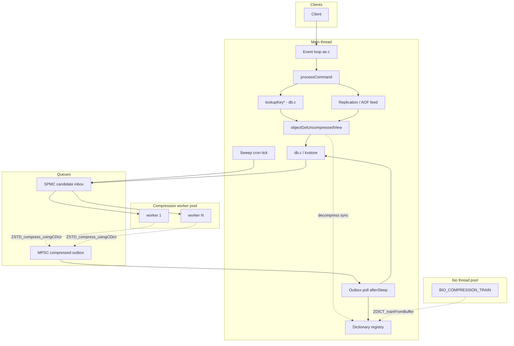
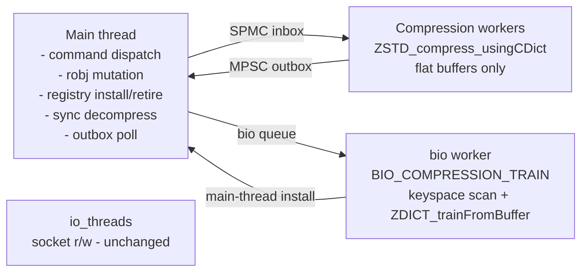

# Detailed Design — Real-time In-memory Value Compression for Valkey

_Status: proposed, v1_
_Scope: `OBJ_STRING` values only_
_Source issue: [valkey-io/valkey #3423](https://github.com/valkey-io/valkey/issues/3423)_

---

## Table of contents

1. [Overview](#1-overview)
2. [Detailed requirements](#2-detailed-requirements)
3. [Architecture overview](#3-architecture-overview)
4. [Components and interfaces](#4-components-and-interfaces)
5. [Data models](#5-data-models)
6. [Error handling](#6-error-handling)
7. [Testing strategy](#7-testing-strategy)
8. [Appendix A — Technology choices](#appendix-a--technology-choices)
9. [Appendix B — Research findings summary](#appendix-b--research-findings-summary)
10. [Appendix C — Alternative approaches considered](#appendix-c--alternative-approaches-considered)
11. [Appendix D — Explicit v1 non-goals and v2 roadmap](#appendix-d--explicit-v1-non-goals-and-v2-roadmap)
12. [Appendix E — Read-path decompression: design exploration](#appendix-e--read-path-decompression-design-exploration)

---

## 1. Overview

### 1.1 What this feature does

Valkey keeps values in memory as SDS strings. For workloads dominated by `OBJ_STRING` values of moderate size (256 B – 1 MiB) with repetitive content (JSON blobs, URL-keyed DTOs, HTML fragments, serialized protocol buffers, etc.), a large fraction of the memory footprint is compressible. Internal fleet analysis on AWS ElastiCache shows ≥50% memory savings are achievable on 92% of memory-bound production snapshots using ZSTD with a trained dictionary.

This feature adds **opt-in, transparent, server-side, in-memory compression** for `OBJ_STRING` values. Compressed values are automatically decompressed on every **client-facing read path** (client commands, scripts, transactions, the replication feed, AOF writer, module API), so no client or operational tooling changes are required. The feature is disabled by default; enabled, it is fully observable via `INFO`, controllable via `CONFIG SET compression-*` and a new `COMPRESSION` subcommand container, and bounded in both CPU and memory overhead.

Note: the **on-disk RDB file may contain compressed values** (to preserve the memory win across restarts and shrink snapshot size/save time). This is the one intentional exception to "decompressed at every boundary" — it is an internal persistence format, not a client-facing read path. See §2.6 for the full persistence-boundary specification; full-sync replication RDB streams are always uncompressed per R2.6.8.

### 1.2 Headline scope statement

> v1 ships compression for `OBJ_STRING` values only, with synchronous decompression on the main thread, one active dictionary per server, self-trained by a keyspace-scan job on `bio`, with explicit operator controls (`COMPRESSION` subcommands + `compression-*` configs). All other value types, async decompression, adaptive behaviors, and cluster-level dictionary coordination are explicit v2 scope.

### 1.3 Goals

- **Reduce memory** by ≥30% on target workloads (POC baseline) at production-safe CPU cost (<20% TPS degradation).
- **Transparent** to clients, scripts, transactions, replication, AOF, and modules — no wire or semantic changes.
- **Opt-in**, with a single master switch (`compression-master-switch`) and zero fixed cost when set to `off`.
- **Observable** — memory saved, compression ratio, training events, dict lifecycle, and errors exposed via `INFO`, logs, and latency monitor.
- **Bounded blast radius** — the feature is encapsulated in a small number of files; existing code paths are touched only through well-defined helpers.
- **Extensible** — the encoding-tag design structurally supports future value types and async decompression without breaking changes.

### 1.4 Non-goals (v1)

See [Appendix D](#appendix-d--explicit-v1-non-goals-and-v2-roadmap). Key exclusions: non-string data types; async decompression; decompressed-view cache; adaptive kill-switch; compressed-in-place MIGRATE; cluster-wide dictionary gossip; advanced trainer tuning; module-provided compression backends.

---

## 2. Detailed requirements

Requirements are consolidated from `idea-honing.md`. Each bullet is traceable to a Q1–Q16 discussion.

### 2.1 Master switch and operator surface

The feature is governed by **three orthogonal mechanics**:

1. **Master switch** (`compression-master-switch`) — operator declares the desired DB compression state.
2. **Sweeper** (`compression-automatic-sweeper`) — drives the keyspace toward the master-switch-declared state when enabled.
3. **Read-path transient view** (R2.5.7) — read optimization whose drain mode (restore vs. permanent-decompress) is gated on the master-switch state.

Mechanics 1 and 2 are configured independently. Mechanic 3 follows from mechanic 1 automatically (no separate operator control). See §3 for the architecture-level treatment.

- **R2.1.1** `compression-master-switch` (enum, default `off`, `MODIFIABLE_CONFIG`). Operator declares the desired DB state. Three values:
  - `off` — feature is paused. New writes do not compress. Reads decompress-then-restore via the transient view (R2.5.7); the DB compression state is frozen across an arbitrary period. No background work. Existing compressed frames are preserved across reads (the transient view restores them at every event-loop boundary). (Q5)
  - `compression` — new writes are compressed when eligible (R2.2). Reads decompress-then-restore via the transient view (R2.5.7). Productive state for compressed workloads. (Q5)
  - `decompression` — new writes do not compress. Reads decompress permanently (transient view permanent-decompress mode, R2.5.7). The active dict is auto-retired on transition (R2.1.5) so it can drain. Operator-driven drain mode. (Q5)

- **R2.1.2** `compression-automatic-sweeper` (enum, default `disabled`, `MODIFIABLE_CONFIG`). Controls automatic background work that drives the keyspace toward the master-switch-declared state. Two values:
  - `disabled` — no automatic work. Operator can still trigger one-shot passes via `COMPRESSION SWEEP FORCE` (R2.1.4). (Q5)
  - `enabled` — sweeper runs cron-driven passes that converge the keyspace toward the master-switch-declared state. With `master=compression`, the sweep enqueues qualifying RAW values to the worker pool. With `master=decompression`, the sweep calls `compressionPermanentlyDecompress` directly per key on the main thread (worker pool is bypassed). With `master=off`, the sweeper has no direction and idles. The sweep itself is paced by `compression-sweep-max-cpu-pct` (R2.11.2). (Q5)

- **R2.1.3** `compression-automatic-sweeper-interval` (time, default `0`, `MODIFIABLE_CONFIG`). Controls re-runs of the sweeper after a pass completes. Default `0` is "no periodic re-runs" — the sweeper does ONE pass on master-switch direction change and then idles. The first pass on direction change runs immediately regardless of this setting; the interval governs subsequent re-runs. (Q5)
  - `0` — sweeper does one pass and stops. Catch-up requires `COMPRESSION SWEEP FORCE` or a master-switch direction change. Recommended default — minimizes idle-keyspace iteration cost. The sweeper still runs the initial pass after a direction change so the operator's declared state is achieved at least once.
  - Positive N — sleep N seconds between passes. Useful for workloads where missed items accumulate (sustained worker-pool back-pressure drops, eligibility-predicate config changes that newly qualify values). For very large keyspaces a single pass at default `compression-sweep-max-cpu-pct=25` may take longer than the configured interval, in which case the sweeper effectively runs continuously — that's natural scaling, not an error.

- **R2.1.4** `COMPRESSION SWEEP FORCE` (operator command — see §4.5). Triggers an immediate one-shot pass regardless of the `compression-automatic-sweeper` setting and regardless of the periodic timer. Uses the master-switch's current direction. Behavior:
  - `master=off` → reject with `-ERR compression is off`. There is no direction to sweep in.
  - **Preempts any in-flight scan** (automatic or a previous force) — resets cursor and starts fresh from the top on the next cron tick. The operator-facing semantic is "do a pass now, from scratch, regardless of what was running".
  - sweeper disabled: run one pass; the `compression-automatic-sweeper` config is **not changed** (FORCE is a verb, not a state).

  This is the operator's catch-up affordance — they can leave `compression-automatic-sweeper=disabled` (no idle-keyspace iteration) and run `SWEEP FORCE` from a runbook, cron job, or after observing `compression_candidates_dropped_total` climb. (Q5)

- **R2.1.5** Master-switch transitions:
  - **Any direction change with `compression-automatic-sweeper=enabled`** → wake the sweeper from sleeping/idle, reset cursor, restart pass with the new direction. The sweeper takes its direction from the current master-switch state on every iteration; mid-pass switches resolve at the next cron tick.
  - **Any transition INTO `decompression`** (from `compression` or from `off`) → the active dict is auto-retired (`compressionRegistryRetire(active)`) if there is one. The drain mode requires the dict to be in `RETIRING` state so `canFree()` can succeed once `frame_refs == 0` and workers have quiesced past the snapshot (§4.4 QSBR); without the retire, the dict would stay ACTIVE and never be reclaimed even after drain completes. New compression eligibility is gated by `master == compression`, so the dict cannot accept new frame references in the new state — retirement is safe. Workers are protected by QSBR; existing compressed frames keep their refs and the dict stays in `RETIRING` state until they all drain.
  - **`compression → off`** → no auto-retirement. The `off` state freezes the DB compression state — existing compressed frames stay compressed, the active dict stays in the registry as ACTIVE, no background work runs. If the operator later flips back to `compression`, productive operation resumes with the same active dict (no retraining required). If the operator instead flips to `decompression`, the retire-on-transition-into-decompression rule (above) handles it then. Operator can manually reclaim the dict via `COMPRESSION DICT DROP <id>` if memory reclamation is desired during a `compression → off` pause.
  - **`decompression → off`** → no additional action. The active dict was already retired on the prior transition into `decompression`; it continues draining if frames remain. Once `frame_refs == 0` and workers have quiesced, the dict is freed automatically regardless of the master-switch state at that moment.
  - **`off → compression` or `decompression → compression`** → no auto-retirement. From `off`: the previously-active dict (if any) remains ACTIVE and is reused for new compressions — no retraining. From `decompression`: there is no active dict (was retired on the earlier transition); the system enters R2.1.7's "no active dict" sub-state until training fires (R2.3.5) and a new dict is promoted.

  Effect: with `master=decompression + compression-automatic-sweeper=enabled` running to completion, the active dict's memory is auto-reclaimed once drain completes, without operator intervention. With `master=off`, the registry state is frozen — operator must explicitly drop dicts to reclaim. (Q5)

- **R2.1.6** Configuration validation rules. All combinations of `(master, sweeper, threads)` are allowed; the operator owns the controls and Valkey reports the consequences. Two combinations are non-functional but allowed (warned, not rejected):
  - **`master=off + sweeper=enabled`** — sweeper has no direction; idles. Documented as a no-op state. No warning logged on its own; the situation is implied by the master-switch state.
  - **`master=compression + compression-threads=0`** — write-path enqueues drop (worker pool refuses), and a sweep pass would also drop every candidate. Logged at `LL_WARNING` once on transition into this state (boot config, the `compression-master-switch` apply hook, or the `compression-threads` apply hook). When the sweeper is scheduled in this state, it skips the pass with a rate-limited warning rather than iterating the keyspace pointlessly.

  `master=decompression` and `master=off` are agnostic to `compression-threads` count — the worker pool is exclusively used for forward-direction (compress) work. Decompression sweeps and transient-view permanent-decompress run on the main thread. (Q5)

- **R2.1.7** Third state — "`master=compression` but no active dictionary for new writes" — behaves identically to `off` for writes. Decompression of any existing compressed frames continues to work: refcount-based dictionary retirement (R2.3.4) and the safety check in `COMPRESSION DICT DROP` (§4.5) together guarantee that a dict cannot be freed while any frame references it. A "retiring" dict stays in the registry and services decompressions until its last referencing frame is rewritten, overwritten, expired, or explicitly decompressed. The state *"no dicts in registry AND compressed frames exist"* is by-construction unreachable. Documented as expected behavior. (Q5)

### 2.2 Value eligibility

The compression sweeper considers a value eligible iff the predicate holds:

```
eligible(obj) ⇔
    obj->type == OBJ_STRING
 && obj->encoding == OBJ_ENCODING_RAW
 && obj->refcount != OBJ_SHARED_REFCOUNT
 && sdslen(val) >= compression-min-value-size
 && (compression-max-value-size == 0 || sdslen(val) <= compression-max-value-size)
 && hot_key_check(obj)                                        // see below — policy-aware

where hot_key_check(obj) is:
    if lfu_mode:                                              // robj->lru encodes a freq counter
        lfu_freq(obj) < compression-lfu-threshold
    else:                                                     // LRU/noeviction: robj->lru is seconds-based
        lru_idle_secs(obj) >= compression-min-idle-seconds
```
(Q6, Q7)

The eligibility surface has a single time-based knob in LRU/noeviction modes (`compression-min-idle-seconds`) and a single freq-based knob in LFU mode (`compression-lfu-threshold`):

- **LRU and noeviction modes:** `robj->lru` is touched on every read and every write, so `lru_idle_secs(obj)` reflects time-since-last-touch regardless of source. v1 cannot distinguish read-recency from write-recency from this single signal, so a single threshold gates eligibility on the "value has been quiet long enough to be worth compressing" property.
- **LFU mode:** `robj->lru` encodes a 16-bit minutes counter + 8-bit freq counter. There is no per-second access timestamp, so the time-based threshold cannot be applied meaningfully. The freq counter IS the access-recency signal — high freq = recently or repeatedly accessed — and `compression-lfu-threshold` filters on it directly.

Earlier drafts of this design also exposed `compression-settle-seconds` as a "recent-write protection" knob alongside `compression-min-idle-seconds`. Both compared to the same metric (`lru_idle_secs(obj)`), so the effective behavior was always `idle >= max(settle, min_idle)` — the second knob added no expressive power v1 could deliver, only a footgun (operators tuning them differently expecting different effects). The dual surface was justified as forward-compat for a hypothetical v2 with per-object write-time tracking; per the YAGNI principle and Valkey's preference for minimal operator surfaces (see PR #1 Thread #3, the 5+11 → 5+10 split), v1 ships only the single knob. v2 can reintroduce a second knob non-breakingly when the underlying signal genuinely supports it.

**Post-compression net-savings guard** runs on the main thread after the worker returns:

```
compressed_size + header_size >= uncompressed_size * (1 - compression-min-savings-ratio)
  → discard compressed form, leave value uncompressed, increment
    compression_skipped_incompressible.
```
(Q6)

v1 does **not** track per-key rejection state. Under a fixed dict and a fixed workload, the probability that any given write at key K produces compressible bytes is constant — time-based throttling between retries doesn't shift this probability, it only spaces attempts. CPU bounding is already provided at the sweep level (`compression-sweep-max-cpu-pct`); per-key throttling would be redundant with that, while adding correctness burden (stale entries when a key is overwritten via `dbOverwrite` or in-place-mutated via APPEND/SETRANGE/BITOP/BITFIELD/module DMA writes — every mutation path would need a `Clear` integration point).

The legitimate trigger for "the dict has stopped fitting the workload" is **dict change**, which is handled at the system level. Rejected attempts contribute their actual measured ratio to `compression_live_ratio_10m` (R2.10.1) — typically in `[0.9, 1.05]` since the net-savings guard rejected them for being too close to 1.0 — so a sustained high rejection rate naturally drives the metric toward "no savings" and trips the drift threshold, firing retraining (R2.3.5). After dict promotion, the next sweep tick re-attempts under the new dict naturally — no per-key state required.

This is a deliberate simplification over an earlier design (PR #10) which proposed a per-key `incompressibleKeys` side hashtable scoped by `(key, failed_dict_id)` with a `compression-retry-interval` time fallback. That approach added a module + a config knob + integration points in every mutating code path, but the underlying assumption (waiting between retries improves the per-attempt hit rate) is incorrect for fixed-distribution workloads under a fixed dict. The simpler model — retry on every sweep tick, let the drift signal handle systemic dict-fit issues — is correct and operationally cleaner.

### 2.3 Dictionary lifecycle

- **R2.3.1** The server maintains a **dictionary registry**: a small set of `{dictID, raw_bytes, ZSTD_CDict*, ZSTD_DDict*, refcount, state}` entries. State ∈ `{active, retiring, retired}`. (Q1)
- **R2.3.2** At most **one** dictionary is `active` at any time (the one used to compress new values). Zero-or-more are `retiring` (decompress-only for older frames). (Q1)
- **R2.3.3** The registry is capped at `compression-dict-max-versions` entries (int, default `4`, min `2`, `MODIFIABLE_CONFIG`). When full, retraining/promotion is blocked, a `LL_WARNING` log entry is emitted, and `compression_dict_cap_reached` is set to `1` in `INFO`. Operator unblocks by setting `compression-master-switch decompression` + `compression-automatic-sweeper enabled` (drains compressed frames so retiring dicts can release), by `COMPRESSION DICT DROP <dictID>` (force-retire a specific dict), or by raising the cap. (Q1)
- **R2.3.4** A dict's refcount tracks the number of compressed frames that reference its dictID. When refcount hits zero, the dict transitions to `retired` and its CDict/DDict/raw_bytes are freed. (Q1)
- **R2.3.5** **Training triggers** (Q9):
  - **First training**: fires when the total key count in the database reaches `compression-dict-min-training-keys` (default `1000`). This is a cheap O(1) check via `kvstoreSize`. The scan then collects eligible values (raw strings within size bounds). If the scan completes without collecting at least `compression-dict-min-training-keys` eligible samples, training aborts and enters a 30-second hardcoded cooldown before retrying.
  - **Drift-based steady-state retraining**: fires when `compression_live_ratio_10m > post_training_ratio / compression-dict-drift-ratio` (default drift ratio `70%`).

    The ratio convention is `compressed/uncompressed` (lower is better; see R2.10.1). `compression_live_ratio_10m` is computed over compression *attempts* (successful + rejected) in the rolling 10 min window, weighted by uncompressed bytes. Each successful compression contributes its actual `compressed/uncompressed` ratio. Each rejection (post-compression net-savings guard, R2.4 / §6.6) contributes its actual measured ratio (typically in `[0.9, 1.05]` since the net-savings guard rejected it for being too close to 1.0). Worker errors are excluded from the metric — they're tracked separately via `compression_errors_total`. With drift_ratio = 0.7, drift fires when the current ratio exceeds post-training by a factor of `1/0.7 ≈ 1.43` — i.e., compression efficiency has degraded by about 43%. Both forms of degradation feed the metric uniformly:
      - workload-content drift among compressible values (post-training values were highly compressible; live values compress worse), and
      - workload composition drift (a growing fraction of values compress poorly enough to fail the net-savings guard).
  - **Optional time-based retraining**: `compression-dict-refresh-interval` (default `0` = disabled).
  - **Manual**: `COMPRESSION TRAIN` forces an immediate training job.
- **R2.3.6** **Training sampling — main-thread iteration, bio-thread training, no sustained reservoir.**
  - **State**: all training state is file-scoped static in `compression_train.c`. A single `compressionTrainState` struct holds: state (IDLE/SCANNING/SUBMITTED/COOLDOWN), current_db, cursor, buffer, sizes[], sample_count, buffer_used, cooldown_until. Only one training can be in progress at a time.
  - **Trigger**: a unified `training_requested` flag evaluated in `compressionCron`. Set when: (a) no active dict AND total DB keys ≥ `compression-dict-min-training-keys`, (b) drift detected, (c) refresh interval expired, or (d) manual `COMPRESSION TRAIN` command. All conditions OR'd under one check. Scan starts only if state==IDLE, training_requested is set, and not in cooldown.
  - **Allocation**: at scan start, pre-allocate `compression-training-buffer-size` bytes (default 16 MiB) for the sample buffer and `compression-dict-max-training-keys` × sizeof(size_t) for the sizes array. Single allocation per training cycle, no realloc during scan.
  - **Scan iteration**: the main thread walks all DBs sequentially (db0, db1, ..., dbN) using `kvstoreScan` with `LOOKUP_NOTOUCH` semantics. Scan progress (current_db + cursor) persists across cron ticks. Each tick is time-budgeted to ~100 µs; time is checked after every `kvstoreScan` call (each call processes one hash table bucket). At default hz=10, a full 10K-sample scan completes in ~10 seconds.
  - **Scan callback**: invoked per key in a bucket (cannot stop mid-bucket). Skips non-RAW-string values, values outside size bounds (`compression-min-value-size` / `compression-max-value-size`). Checks caps before copying — if sample_count ≥ max or buffer_used + len > max buffer, returns without copying (guards against overflow; outer loop terminates scan after bucket completes). On eligible hit: memcpy value bytes into buffer, record size in sizes[], increment counters.
  - **Caps**: scan stops when: sample_count == `compression-dict-max-training-keys` (10K), OR remaining buffer space < `compression-min-value-size` (no eligible value can fit), OR all DBs exhausted (cursor wraps on last DB). *Alternative considered*: allocate buffer_size + max_value_size headroom, stop when buffer_used ≥ configured cap — avoids scanning for values that barely fit. Deferred to simplify initial implementation.
  - **Submit or abort**: after scan completes, if sample_count ≥ `compression-dict-min-training-keys` (1000) → submit to bio (ownership of buffer+sizes transfers to bio). If below minimum → free buffer+sizes, log `LL_WARNING`, enter 30-second hardcoded cooldown.
  - **Bio job** (`BIO_COMPRESSION_TRAIN`): bio thread receives (buffer, sizes, sample_count). Calls `ZDICT_trainFromBuffer`, then creates `ZSTD_CDict` and `ZSTD_DDict` from the trained bytes (avoids CDict/DDict creation cost on the main thread). Frees the training buffer+sizes. Writes result (cdict, ddict, raw dict bytes, size, success/error) to a file-scoped static result via `compressionTrainCompleteFromBio`.
  - **Completion**: main thread polls the static result pointer in `compressionCron`. On success → promotes via `compressionRegistryAdd(pair, promote=1)` (trivial pointer swap). On failure → logs error, enters cooldown. Resets state to IDLE.
  - **Invariants**: iteration and any `kvstore`/`refcount` manipulation stay on the main thread; bio never touches `robj`, `kvstore`, or refcounts (consistent with R2.11.4). Training reads do not update LRU/LFU. The training buffer is transient (freed once bio completes). Spread-in-time sampling does not meaningfully affect dictionary quality — each collected sample is an immutable snapshot of real bytes at copy time, and drift-retraining (R2.3.5) is the backstop for post-training workload shifts. (Q9)
- **R2.3.7** **Training location**: a new `bio` job type `BIO_COMPRESSION_TRAIN`. Fits the `bio` model (long-running, infrequent, one-at-a-time). Does not occupy a compression worker. Bio also creates CDict/DDict from the trained bytes before signaling completion. (Q9)
- **R2.3.8** **Training algorithm**: `ZDICT_trainFromBuffer` with target size `compression-dict-size` (default `102400` bytes). Advanced tuning is v2. (Q9)
- **R2.3.9** **Promotion**: after training, the main thread creates `ZSTD_CDict` and `ZSTD_DDict` from the new bytes, inserts into the registry with a fresh dictID, atomically swaps the `active` pointer, and transitions the previous active to `retiring`. (Q1, Q9)
- **R2.3.10** **Preshared dictionary**: `COMPRESSION DICT IMPORT <base64-bytes>` installs as a new registry entry, going through the same promotion path as a trained dictionary. `COMPRESSION DICT EXPORT <dictID>` returns raw dictionary bytes (base64). Both require `@admin` ACL. (Q2)

### 2.4 Compression path

- **R2.4.1** Eligible values are enqueued on a **candidate queue** (SPMC) by write paths (`dbAdd`, `dbOverwrite`) when the eligibility predicate holds at write time, and by the **background sweeper** during its cron tick. (Q6, Q8)
- **R2.4.2** Compression workers (separate pool from `io-threads`) dequeue from the candidate queue, call `ZSTD_compress_usingCDict` on the flat value bytes, and post the result to an outbox (MPSC). Workers **never touch `robj`**. (Q8)
- **R2.4.3** The main thread polls the outbox on `afterSleep`/cron, runs the post-compression net-savings guard (R2.2 second block), and if accepted:
  - Allocates the compressed buffer (header + ZSTD frame).
  - `zfree`s the old uncompressed sds; `zmalloc`s the new buffer. `used_memory` accounting is correct automatically (Q14).
  - Mutates `robj->val_ptr` to the new buffer, sets `encoding = OBJ_ENCODING_COMPRESSED`.
  - Increments the dictID refcount.
  - Does **not** call `signalModifiedKey`. Background compression is a storage change, not a logical value change. (Q11)
- **R2.4.4** **Immutable-snapshot invariant.** A compression worker reads `src` bytes concurrently with the main thread. Correctness requires that those bytes are **not mutated in place** while the worker runs. v1 relies on Valkey's existing copy-on-write discipline: every command that mutates an existing `OBJ_STRING` value MUST funnel through `dbUnshareStringValue()` (or an equivalent refcount check) **before** modifying `val->ptr`. When a compression job is queued, the main thread holds `incrRefCount(val)`, forcing `refcount >= 2`; the next mutating command sees the bumped refcount and creates a COW copy via `dbUnshareStringValue`, leaving the original bytes immutable for the worker. The rule: **if refcount > 1, thou shalt not mutate in place** — this is a pre-existing Valkey invariant; compression only depends on it, does not introduce it.
- **R2.4.5** **Invariant-enforcement audit (v1 sign-off checklist).** The `dbUnshareStringValue`-before-mutate discipline is code-discipline, not enforced by the type system, so the design commits to auditing every mutating string code path before v1 merges. Required sites:
  - `src/t_string.c` — `appendCommand`, `setrangeCommand`, `getsetCommand`, `getdelCommand`, `setCommand` (overwrite path), and any command that writes to an existing value's sds.
  - `src/bitops.c` — `setbitCommand`, `bitopCommand` (write targets), `bitfieldCommand` (write-intent operations), `bitcountCommand` is read-only so OK.
  - `src/module.c` — `VM_StringDMA` with `REDISMODULE_WRITE` intent path; `VM_StringAppendBuffer`; `VM_StringTruncate`. All MUST call `dbUnshareStringValue` (or perform the equivalent refcount-guarded COW) on the underlying `robj` before returning the mutable buffer.
  - `src/debug.c` — any `DEBUG` subcommand that mutates string values.
  - **New code paths introduced by this feature** — ensure none bypass the discipline.
  - The audit is tracked as a merge-blocker test (see §7.2 `tests/unit/compression-cow-invariant.tcl`). Any newly discovered violator either calls `dbUnshareStringValue` or is documented in `src/t_string.c` header as a reason to skip compression for its key (add to the eligibility filter). (Q4-review feedback)
- **R2.4.6** **Fallback path if the invariant fails.** If the post-compression net-savings guard passes but the worker's output doesn't round-trip to the *current* value (main thread decompresses the result and memcmps against live bytes as a cheap sanity check in debug builds), the result is discarded, `compression_errors_total` increments, and a `LL_WARNING` log entry identifies the command that ran during the window. This is a belt-and-suspenders guard; in a correct implementation it fires zero times. The check is gated behind `#ifdef DEBUG_COMPRESSION_SNAPSHOT` so it has no prod cost.

### 2.5 Decompression path

- **R2.5.1** All decompression is **synchronous on the main thread** in v1. No worker-side decompression path exists. (Q7)
- **R2.5.2** A single helper function `robj *objectGetUncompressedView(robj *o, sds *scratch, robj *view_out)` is the **only** decoder primitive in v1:
  - If `o->encoding != OBJ_ENCODING_COMPRESSED`: returns `o` unchanged. `*scratch` and `*view_out` are NOT touched. Zero cost.
  - Otherwise: looks up the dictID in the registry, calls `ZSTD_decompress_usingDDict` into the caller-provided `*scratch` sds (allocated/grown as needed), populates `*view_out` (caller-provided storage; typically stack-allocated, marked `OBJ_STATIC_REFCOUNT`) to wrap the decompressed bytes, and returns `view_out`.
  - Returns `NULL` on any failure (corrupt header, missing dict, ZSTD error). Caller logs / increments `compression_errors_total` and translates to a client-visible error.
  - Rationale for the `view_out` out-parameter (vs returning a heap robj): keeps every read of every compressed value off the allocator hot path. Stack-allocated `robj` + `OBJ_STATIC_REFCOUNT` matches the existing `initStaticStringObject` pattern in `server.h`.

  **In v1 the helper is called from inside `lookupKey*`** when the caller does NOT pass the `LOOKUP_NO_BYTES` opt-out flag; this implements the transient-view model (R2.5.7). A small set of paths that bypass lookupKey (AOF rewrite child, RDB save for replication full-sync, R2.6.8) call the helper directly. The helper itself is unchanged across these call sites — the centralization is in *who* calls it, not in *how* it works.
- **R2.5.3** The helper **must not** call `signalModifiedKey`. (Q11)
- **R2.5.4** `compression-max-value-size` (default `131072` bytes = 128 KiB, `0` = no bound) excludes values large enough that their main-thread decompression cost is not worth the memory win, keeping per-read decompression latency within the event-loop budget. (Q7)
- **R2.5.5** **Per-read decompression cost is proportional to value size** (~1 µs/KB at ZSTD level 3 with dictionary). **Multi-key commands pay the sum of per-value costs**, with no per-command cap — by design: a per-command cap would either break transparency (error mid-command) or defeat its own purpose (block). v1 is tuned for the small/moderate-value sweet spot (256 B – 8 KB). Workloads that routinely read many compressed values per command (wide `MGET`, long `SORT`, scripts touching many keys, heavy pipelines over large values) should benchmark before enabling; their remedies are (a) raise `compression-min-value-size` or lower `compression-max-value-size` to exclude the large values, or (b) wait for v2 async decompression. (Q7)
- **R2.5.6** **Compression decisions are not reconsidered post-compression in v1.** Cold values remain compressed across read cycles — the transient-view model (R2.5.7) preserves this property by restoring the compressed form at every event-loop boundary via a free pointer-swap. The transient model also amortizes per-read CPU within an iteration: when a compressed key is read N times during a single event-loop iteration, only one decompression occurs (the first read flips encoding to RAW for the iteration; subsequent reads consume the same RAW view; restoration at `beforeSleep` reverts encoding via pointer-swap with no compression cost).

    The eligibility filter (R2.2) skips recently-accessed values at compression-attempt time, but provides no inverse path: a key that was cold when compressed and later becomes read-hot will pay sustained per-iteration decompression CPU on the main thread for every iteration that touches it.

    Natural pressure-relief exists for keys that get **written** after compression: `dbOverwrite` installs a fresh uncompressed robj, and partial-write commands (`APPEND`, `SETRANGE`, bit operations, module DMA-write per R2.7.6) decompress in place before mutating (the COW-invariant audit list in R2.4.5 enumerates the call sites). Read-only-hot keys have no equivalent demotion trigger.

    Worst-case per-iteration decompression cost is bounded by `compression-max-value-size` (R2.5.4: 128 KiB → ~128 µs at ~1 µs/KB). Cumulative cost is observable via `LATENCY HISTORY decompress-sync` (R2.10.2). Operators detecting the regression in `INFO compression` / latency monitor can drain the keyspace by setting `compression-master-switch decompression` (which auto-retires the active dict per R2.1.5 and switches the transient view to permanent-decompress mode per R2.5.7) and `compression-automatic-sweeper enabled` (R2.1.2) to converge the keyspace to fully RAW.

    Auto-demotion of read-hot compressed values is explicit v2 scope (Appendix D — "Read-hot compressed value auto-demotion"). The v1 ship gate is that the cost is **bounded** (R2.5.4) and **observable** (R2.10.2); operator action remains the only demotion path.

- **R2.5.7** **Transient decompression model.** Sub-section §2.5.1–§2.5.6 describes *what* decompression looks like to callers. R2.5.7 specifies *where* it is integrated into the read path. The single decoder helper (R2.5.2) is called from inside `lookupKey*` when the caller does NOT pass the new `LOOKUP_NO_BYTES` opt-out flag. The lookupKey path then:

    1. Decompresses the value into a freshly-allocated **temp uncompressed sds**.
    2. Saves the original compressed buffer pointer in a per-server **decompression side-map**, keyed by the robj address.
    3. `incrRefCount(o)` to pin the robj for the duration of the transient state.
    4. Replaces `o->val_ptr` with the temp sds and flips `o->encoding` from `OBJ_ENCODING_COMPRESSED` to `OBJ_ENCODING_RAW`.
    5. Returns `o` — every caller downstream sees a normal RAW string robj, with no awareness of compression.

    **Drain mode at the next event-loop boundary** is gated on `compression-master-switch` state (R2.1.1). The `beforeSleep` hook reads the master switch once per invocation and dispatches:

    | Master switch | Drain mode | Per-entry behavior |
    |---|---|---|
    | `compression` or `off` | **restore** | Pointer-swap each side-map entry back to compressed (the default behavior described below). The compressed form is preserved across the iteration boundary. |
    | `decompression` | **permanent-decompress** | Each side-map entry is finalized as RAW: the compressed buffer is released via `releaseCompressedBuffer` (decRef dict frame-ref + reverse install accounting + free buffer); the temp sds stays installed as the value's `val_ptr`; encoding stays `OBJ_ENCODING_RAW`. The value is now permanently decompressed. |

    This is the only cross-mechanism dependency in the design (Master switch ↔ Transient view per R2.1's three-orthogonal-mechanics framing). It exists because in `decompression` mode the operator's intent is "drain the DB", and a transient view that restores the compressed form would defeat that intent: every read-touched key would oscillate between compressed and uncompressed each iteration. Permanent-decompress mode honors the operator's declared state.

    **Restore mode (default, `master ∈ {compression, off}`).** The `beforeSleep` hook calls `compressionRestoreTouchedKeys()` which iterates the side-map:

    - For each entry, re-fetch the kvstore slot for the key.
    - If `slot->value == o` (the pinned robj is still in the slot, unchanged), restore via pointer swap: free temp sds, restore compressed buffer to `val_ptr`, flip encoding back to `OBJ_ENCODING_COMPRESSED`. **This is O(1) per entry with no decompression or compression cost** — the compressed bytes never went away, we just had val_ptr point at the temp sds during the iteration.
    - If `slot->value != o` (the value was overwritten, expired, or COW'd by a mutating command), discard the entry: free the temp sds, release the saved compressed buffer (via `releaseCompressedBuffer` — decRef dict + reverse accounting), decrement the pin (which may free the orphaned robj).

    **Permanent-decompress mode (`master == decompression`).** Same iteration; for each entry, regardless of slot occupancy:
    - Release the saved compressed buffer (decRef dict frame-ref + reverse install accounting + zfree via `releaseCompressedBuffer`).
    - Leave the temp sds installed as `val_ptr`; encoding already RAW from materialize.
    - Decrement the pin.

    The two modes share `discardTransientEntry`'s release-and-decRef cleanup logic; only the restore vs leave-as-RAW step differs.

    **Mutation-detection invariant.** The pin (`refcount = 2`) forces any subsequent mutating command to honor the `dbUnshareStringValue` discipline (R2.4.4), creating a fresh robj that replaces the kvstore slot. The original (transient) robj is left intact for restoration; the slot now points elsewhere — detected at restoration time via pointer comparison. **No mutation-time hook is needed in any byte-mutating site.** This is the same staleness mechanism used by the write-path drain handler (R2.4.3 / §4.6).

    **ABA safety.** The pin keeps the original robj address reserved by the allocator for the duration of the transient state. A subsequent mutation creates a new robj at a different address. Pointer comparison at restoration time is therefore decisive (same property as the dict-lifetime invariant in §4.4 and the write-path stale check in §4.6).

    **Memory bound.** A naive transient-view implementation would let peak memory during an event-loop iteration grow as `sum(uncompressed_i) + sum(compressed_i)` over the keys touched — i.e., **`(1 + ratio)` × the no-compression baseline**, since both the temp sds and the compressed buffer live simultaneously for each entry. With `compression-max-value-size = 128 KiB` and a Lua script that touches 10 000 compressed keys without yielding, peak memory could reach ~1.5 GB above baseline.

    To prevent this OOM hazard, materialize is **capped against the running compression-savings counter**: `transient_view_uncompressed_bytes ≤ compression_savings_bytes` where `compression_savings_bytes = total_uncompressed - total_compressed` across all currently-installed compressed frames. When the next materialize would exceed the cap, the path falls back to **permanent decompress** for that value (the same code that handles `LOOKUP_WRITE` lookups). The fallback releases the compressed form for that specific value, freeing memory the side-map would otherwise have held; the value re-compresses on the next sweep tick if still eligible.

    The cap is a **derived signal** — no operator-tunable knob. Its semantic is the right invariant: while transient views never spend more than what compression has saved, peak memory stays at-or-below the no-compression baseline by construction. Cap exhaustion is observable via `compression_transient_view_capped_total` (S4.1 surfaces it via `INFO compression`).

    **Deferred-pointer-capture sites within the lookupKey-routed path.** A small number of code paths capture a pointer derived from `val_ptr` into a structure that persists across the event-loop boundary, most notably `_addBulkStrRefToBufferOrList` (the bulk-reply zero-copy path used by `tryAvoidBulkStrCopyToReply`). For these sites the transient-view model would otherwise produce a use-after-free at IO-thread write time. The fix is to force-copy on bulk replies when the robj is in the transient-view side-map: `isCopyAvoidPreferred` returns 0 via a `transientViewActive(obj)` predicate (O(1) hashtable lookup keyed by robj pointer). See Appendix E.7 for the full audit and resolution; the implementation lands with the side-map (PR 2 of the S2.8 split).

    **Sites that bypass `lookupKey*` and need explicit decompression.** Three out-of-process or special paths do not benefit from the lookupKey-level centralization:
    - AOF rewrite child (`rewriteAppendOnlyFileRio`) — iterates kvstore directly via `kvstoreIteratorNext`; fork-time snapshot. Calls `objectGetUncompressedView` explicitly.
    - RDB save for replication full-sync (R2.6.8) — same iteration pattern; explicit decompression.
    - Disk RDB write (R2.6.1) — emits compressed bytes + AUX dict directly; **no decompression needed**.

    The replication feed (`feedReplicationBufferWithObject` in `src/replication.c`) operates on `argv` arguments and synthetic SELECT robjs — never on kvstore values. **No decompression needed.** AOF append (steady-state) likewise propagates command argv, not kvstore values.

    **`LOOKUP_NO_BYTES` flag plumbing.** Most lookupKey* callers read value bytes; the default behavior (no flag) is to decompress into a transient view. The few callers that don't read bytes (introspection: `OBJECT ENCODING`, `DEBUG OBJECT`, `MEMORY USAGE`; existence checks like `EXISTS` / `TYPE`; eviction sampler; active-expiry; TTL/expire commands) explicitly opt out by passing `LOOKUP_NO_BYTES`. This preserves the operator-visible encoding (compressed values appear as `compressed` to introspection commands) and avoids unnecessary decompression CPU on metadata-only paths.

### 2.6 Persistence

- **R2.6.1** **RDB on-disk format** (Q12, research `persistence-and-replication.md`):
  - New string encoding marker `RDB_ENC_COMPRESSED` (value `4`). The marker is generic — it says "a compressed payload follows" without naming the algorithm, so future backends (LZ4, snappy, hardware) can reuse the same encoding byte.
  - Layout per compressed value: `[RDB_ENCVAL | alg_magic (len-encoded) | alg_meta (len-encoded) | uncompressed_len (len-encoded) | compressed_len (len-encoded) | compressed frame bytes]`. `alg_magic` is the four-byte algorithm tag (ASCII `ZSTD`, reserved `LZ4 ` etc.); `alg_meta` is interpreted per algorithm — for ZSTD it is the `dict_id` of the referenced dictionary, for a hypothetical LZ4 backend it would be `0` or mode bits. Unknown `alg_magic` → reject as corrupt.
  - Dictionary bytes (ZSTD-specific) are written as `RDB_OPCODE_AUX` entries (key `"compression-dict-<dict_id>"`, value = raw bytes) **before** any compressed value that references them. Non-dict-based algorithms may omit AUX.
  - `RDB_VERSION` is bumped (`80 → 81`). Pre-feature loaders will refuse the file cleanly.
- **R2.6.2** **RDB load when `master ∈ {compression, off}`**: loader reads the dictionary bytes from AUX entries and uses them to construct `ZSTD_CDict`/`ZSTD_DDict` handles (via `ZSTD_createCDict`/`ZSTD_createDDict`; no retraining), inserts them into the registry, decompresses values on the fly only if needed (frames reference their dictID so they stay compressed in memory). With `master=off` the loaded frames stay compressed but are read-only-decompress (no new compressions, no sweeper drain); operator can flip master to `compression` later to resume productive operation, or to `decompression` to start draining. (Q3, Q12)
- **R2.6.3** **RDB load when `master == decompression`**: loader reads the dictionary bytes from AUX entries and constructs only the `ZSTD_DDict` handles needed (no retraining), decompresses every `RDB_ENC_COMPRESSED`-marked value inline, stores uncompressed, discards DDicts after load. This is the canonical "load-and-drain" path — useful for migrations or for loading an RDB on a server that should not maintain the compressed state. (Q3)
- **R2.6.4** **Missing dictionary**: if a compressed value references a dictID for which no AUX entry was emitted, the RDB is rejected as corrupt regardless of the `compression-master-switch` setting. (Q3)
- **R2.6.5** **AOF**: always uncompressed RESP. Writer routes every `robj` through `objectGetUncompressedView` before emitting. (Q12)
- **R2.6.6** **Replication feed**: always uncompressed RESP. `feedReplicationBufferWithObject` routes through `objectGetUncompressedView`. Cross-version replication unaffected. (Q12)
- **R2.6.7** **`DUMP` / `RESTORE` / `MIGRATE`**: v1 decompresses before emitting the RDB chunk. Compressed-in-place migration is v2. (Q12)
- **R2.6.8** **Full-sync replication RDB** (primary → replica during `SYNC`/`PSYNC` full resync): emitted **uncompressed** regardless of `compression-master-switch` state on the primary. When the RDB writer is invoked with a replication sink, every compressed value is routed through `objectGetUncompressedView` before serialization — same helper used by `feedReplicationBufferWithObject`. Disk RDB (local save / `BGSAVE` target) continues to use the `RDB_ENC_COMPRESSED` path from R2.6.1. This keeps cross-version replication working without replica-side awareness and preserves the "wire stays uncompressed RESP/RDB, disk may be compressed" property. Opt-in compressed full-sync (via `REPLCONF` negotiation) is a v2 extension point. (Q12)

### 2.7 Introspection surfaces

- **R2.7.1** **`OBJECT ENCODING key`** returns `compressed` for compressed values. New encoding name documented. (Q13)
- **R2.7.2** **`DEBUG OBJECT key`** extends its debug line with `dictID:<N> compressedlength:<N> uncompressedlength:<N>` when the value is compressed. (Q13)
- **R2.7.3** **`MEMORY USAGE key`** returns compressed footprint (frame + header + `robj` overhead). Matches what eviction and `maxmemory` actually see. (Q13, Q14)
- **R2.7.4** **`TYPE`**, **`OBJECT FREQ`**, **`OBJECT IDLETIME`**: unchanged. (Q13)
- **R2.7.5** **Module API** (`ValkeyModule_StringDMA` read intent, `ValkeyModule_OpenKey`): decompresses transparently via `objectGetUncompressedView`. Existing modules need no changes. (Q13)
- **R2.7.6** **Module API** (`ValkeyModule_StringDMA` write intent on a compressed value): decompresses in place first (mutates `robj` to `raw`, frees the compressed frame), then returns the sds pointer. The value becomes eligible for re-compression on the next sweep tick. (Q13)

### 2.8 Memory accounting

- **R2.8.1** Eviction sampler, `MEMORY USAGE`, and `INFO memory` use the compressed footprint for compressed values, via standard `zmalloc_size` / `used_memory` accounting. No custom accounting layer is introduced. (Q14)
- **R2.8.2** Fixed overhead (CCtx/DCtx, digested dicts in the registry, candidate queue) is allocated via `zmalloc` → counted in `used_memory`. `INFO compression` additionally reports it under `compression_net_saved_bytes`. (Q14)
- **R2.8.3** `MEMORY STATS` sub-aggregate for compression is v2. (Q14)

### 2.9 Scripting and transactions

- **R2.9.1** **Rule 1 — sync-mandatory**: decompression MUST run synchronously on the main thread inside `EVAL`/`EVALSHA`/`FCALL`/`FCALL_RO`, inside queued `MULTI`/`EXEC` transactions, on the replication feed, and on the AOF writer. v1's always-sync model satisfies this automatically. Rule remains as a forward-compatibility constraint for v2. (Q11)
- **R2.9.2** **Rule 2 — no `signalModifiedKey`**: background compression and in-place decompression **must not** call `signalModifiedKey`. This is enforced via the single-entry-point helper (R2.5.2) plus code comments plus tests. (Q11)

### 2.10 Observability

- **R2.10.1** New `INFO compression` section with the following fields (see §5.6):
  `compression_master_switch`, `compression_automatic_sweeper`, `compression_automatic_sweeper_interval`, `compression_sweeper_running`, `compression_state`, `compression_active_dict_id`, `compression_dict_age_seconds`, `compression_known_dicts`, `compression_dict_cap_reached`, `compression_compressed_objects`, `compression_total_uncompressed_bytes`, `compression_total_compressed_bytes`, `compression_ratio`, `compression_live_ratio_10m`, `compression_net_saved_bytes`, `compression_candidates_pending`, `compression_candidates_dropped_total`, `compression_sweep_backpressure_total`, `compression_sweep_pacing_sleeps_total`, `compression_outbox_backpressure_total`, `compression_compressions_per_sec`, `compression_decompressions_per_sec`, `compression_skipped_incompressible`, `compression_training_last_duration_ms`, `compression_training_last_sample_count`, `compression_errors_total`. The `compression_master_switch` reports `compression` / `decompression` / `off` per R2.1.1. The `compression_automatic_sweeper` reports `enabled` / `disabled` per R2.1.2. The `compression_sweeper_running` reports `0` (no scan in flight) or `1` (scan currently advancing) — runtime liveness, separate from the configured switch. (Q10)
- **R2.10.2** Latency-monitor events `compress-sync`, `decompress-sync`, `compression-train` use the existing `latency-monitor-threshold` floor. No new config. (Q10)
- **R2.10.3** **No keyspace notifications** for compression events. Operator audit trail is provided by server log entries at `LL_NOTICE` (normal transitions) and `LL_WARNING` (training failures, cap reached). (Q10)
- **R2.10.4** **Queue back-pressure observability contract.** The worker pool is fed by a single shared bounded queue (§4.6), so "compression is not keeping up" has several distinct root causes and each one has a different remediation. The `INFO compression` section exposes four counters plus one gauge so operators can disambiguate without reading logs:

  | Metric | Increments when | Remedy if climbing |
  |---|---|---|
  | `compression_candidates_pending` *(gauge)* | sampled at INFO time — current inbox depth | — (baseline signal) |
  | `compression_candidates_dropped_total` | write-path enqueue (`dbAdd` / `dbOverwrite` / `dbSetValue`) or multi-key fan-out enqueue finds the inbox full and drops the candidate | raise `compression-threads`; the sweeper will catch dropped keys on its next tick, but while this counter rises some keys are temporarily uncompressed |
  | `compression_sweep_backpressure_total` | the background or manual sweep pauses its iteration cursor because the inbox is full (distinct from CPU-pacing) | raise `compression-threads`; the sweep is ready to generate more work but workers can't absorb it |
  | `compression_sweep_pacing_sleeps_total` | the sweep sleeps because of `compression-sweep-max-cpu-pct` (normal operation) | raise `compression-sweep-max-cpu-pct` if faster keyspace coverage is desired |
  | `compression_outbox_backpressure_total` | a worker retries posting a result because the outbox is full (main thread hasn't drained fast enough) | raise the `compressionAfterSleep` drain budget; generally indicates a bigger main-loop problem |

  **Why `sweep_backpressure_total` and `sweep_pacing_sleeps_total` are distinct:** the sweep has two reasons to sleep — workers can't keep up vs. operator-configured pacing — and they have different remedies (more workers vs. looser pacing). Folding them into one counter would prevent operators from telling which knob to turn.

  **Why write-path drops and future multi-key fan-out drops share one counter:** both are "caller dropped a candidate because the inbox was full" and both are resolved by the same remediation. Distinguishing them does not drive a different action; splitting later is non-breaking if operational experience argues for it.

### 2.11 CPU and concurrency

- **R2.11.1** Dedicated compression worker pool, sized by `compression-threads` (int, default `1`, range `0..16`, `MODIFIABLE_CONFIG`). `0` = disabled (feature becomes no-op). Separate from `io-threads`. (Q8)
- **R2.11.2** Sweep pacing: `compression-sweep-max-cpu-pct` (int, default `25`, range `1..100`, `MODIFIABLE_CONFIG`). Applied only to background sweep batches; training and multi-key compression are naturally arrival-bounded. (Q8)
- **R2.11.3** CPU pinning: `compression_cpulist` (string, default empty). Follows the existing `bio_cpulist` / `aof_rewrite_cpulist` precedent. (Q8)
- **R2.11.4** Compression workers never touch `robj`, never mutate the dictionary registry, and never manage frame refcounts. They atomically load the active dict pointer, use the immutable `CDict*` for compression, produce a flat output buffer, and report a quiescent state. The main thread owns all `robj` mutation, registry mutation, and frame-ref accounting. Dictionary lifetime safety is guaranteed by the QSBR grace-period model (§4.4), not by per-job refcounting. (Q8)

### 2.12 Configuration summary

All configs below are `MODIFIABLE_CONFIG` and persist via `CONFIG REWRITE`. Configs are split into two tiers:

- **Primary** — every operator enabling the feature should review and set these consciously. Documented prominently in `valkey.conf` under a `# Compression` section.
- **Advanced** — defaults are tuned for the common workload (see §2.5 and §2.9 rationales). Touch only for specific tuning; `valkey.conf` groups these below a clearly-labeled `# Compression — advanced tuning` divider so operators aren't required to reason about them.

All configs remain in code and in `CONFIG GET *` / `CONFIG SET`; the split is documentation-only, not a hiding mechanism.

#### Primary knobs (6)

| Name | Type | Default | Scope |
|---|---|---|---|
| `compression-master-switch` | enum | `off` | master switch (R2.1.1). `compression` / `decompression` / `off`. |
| `compression-automatic-sweeper` | enum | `disabled` | automatic background sweeper (R2.1.2). `enabled` / `disabled`. |
| `compression-threads` | int | `1` | worker pool size (0..16; 0 = disabled). Only relevant in `master=compression` mode (R2.1.6). |
| `compression-min-value-size` | bytes | `256` | lower size bound for eligibility |
| `compression-max-value-size` | bytes | `131072` | upper size bound (0 = unbounded; default 128 KiB bounds worst-case sync decompression latency) |
| `compression-dict-size` | bytes | `102400` | zstd trainer target dict size |

#### Advanced knobs (12)

| Name | Type | Default | Scope |
|---|---|---|---|
| `compression-automatic-sweeper-interval` | seconds | `0` | re-run interval after a sweeper pass completes (R2.1.3). `0` = no periodic re-runs (single pass on master-switch direction change, then idle). |
| `compression-sweep-max-cpu-pct` | int | `25` | sweep pacing (1..100) |
| `compression_cpulist` | string | `""` | CPU pinning |
| `compression-min-savings-ratio` | percent | `10` | post-compression net-savings guard |
| `compression-lfu-threshold` | int | `5` | LFU skip-hot-key guard (only active in LFU eviction mode) |
| `compression-min-idle-seconds` | seconds | `60` | LRU/noeviction time-based skip; applies to `lru_idle_secs(obj)`. Inactive in LFU mode (LFU branch uses `compression-lfu-threshold` instead). |
| `compression-dict-min-training-keys` | int | `1000` | Trigger: start a training scan when total keys in the DB reach this count (cheap O(1) check via kvstoreSize). After the scan completes, training is submitted only if the number of collected eligible samples (raw strings within size bounds) meets this minimum. Below ~1000 samples, ZSTD does not have enough volume to produce a dictionary that represents the data distribution well. |
| `compression-dict-max-training-keys` | int | `10000` | Upper cap on samples collected per training scan. Beyond ~10000 samples, ZSTD dictionary quality reaches saturation — additional samples yield negligible improvement while increasing memory and scan time. |
| `compression-training-buffer-size` | size | `16 MiB` | Upper cap on training buffer memory. Pre-allocated in full at scan start. Prevents memory explosion when values are large (without this cap, 10000 × 128KB max-value-size = 1.28 GB). The buffer is transient — allocated at scan start and freed after bio returns the trained dictionary. |
| `compression-dict-drift-ratio` | percent | `70` | retrain drift trigger; fires when `compression_live_ratio_10m > post_training_ratio / drift_ratio` (R2.3.5). Lower values mean less tolerance for degradation (drift fires sooner). |
| `compression-dict-refresh-interval` | seconds | `0` | optional periodic retrain (0 = disabled) |
| `compression-dict-max-versions` | int | `4` | registry cap (min 2) |

---

## 3. Architecture overview

### 3.1 High-level view



### 3.2 Hot-path seams

All feature integration happens at a small, well-defined set of seams:

- **Read path** (`lookupKey*` in `src/db.c`): every type-command handler already funnels through this. Handlers that read value bytes pass no extra flag; the lookup helper transparently decompresses (transient-view model — R2.5.7). Handlers that don't need bytes (introspection, existence checks, expire) pass `LOOKUP_NO_BYTES` to opt out. `objectGetUncompressedView` remains the single decoder primitive (R2.5.2) but is invoked from inside the lookupKey path for centralized control. Three out-of-process paths bypass this hook (AOF rewrite child, RDB save for replication full-sync, worker threads) and call the helper explicitly.
- **Write path** (`dbAddInternal`, `dbSetValue`, `dbOverwrite` in `src/db.c`): on insert/overwrite, check eligibility and enqueue on the candidate inbox. Compression itself happens later, off-thread.
- **Replication feed** (`feedReplicationBufferWithObject` in `src/replication.c`): routes through `objectGetUncompressedView`.
- **AOF writer**: routes through `objectGetUncompressedView`.
- **RDB writer/reader** (`src/rdb.c`): new encoding marker `RDB_ENC_COMPRESSED` + AUX entries for dicts.
- **Cron** (`serverCron` in `src/server.c`): sweep tick enqueues candidates; dict age / drift is evaluated.
- **`afterSleep` hook**: polls the MPSC outbox and installs compressed frames.

### 3.3 Threading model



Separation invariants:
- The worker pool is independent of `io-threads`. They are sized and scheduled separately.
- Workers never touch `robj` or mutate the registry — see §2.11 R2.11.4 for the full worker contract and §4.4 for the QSBR lifetime model.
- `bio` is reused for training (one-at-a-time, long-running); not for per-value compression.
- Synchronous decompression runs on the main thread directly; no offload.

---

## 4. Components and interfaces

All new source files live under `src/`. Every `.c` is registered in **both** `src/Makefile` (in the appropriate `ENGINE_*_OBJ` list) and `src/CMakeLists.txt` per the repo convention.

### 4.1 New source files

| File | Role |
|---|---|
| `src/compression.c` / `compression.h` | Public entry points: `compressionInit`, `compressionCron`, `compressionToggle`, `objectGetUncompressedView`, `compressionIsEligible`, `compressionEnqueueCandidate`, `compressionAfterSleep`, `infoCompression`. |
| `src/compression_registry.c` | Dictionary registry: add / lookup-by-dictID / promote / retire, refcounting, cap enforcement. |
| `src/compression_workers.c` | Worker pool: thread startup/shutdown, SPMC inbox, MPSC outbox, sweep pacing. |
| `src/compression_train.c` | Training: keyspace-scan sample collector, `ZDICT_trainFromBuffer` invocation (called by `bio`). |
| `src/compression_header.c` | Per-value header encode/decode, `OBJ_ENCODING_COMPRESSED` allocation / free helpers. |
| `src/commands/compression-*.json` | Subcommand JSON metadata for `COMPRESSION *` (see §4.5). |

### 4.2 Touched existing files

| File | Change |
|---|---|
| `src/server.h` | New encoding constant `OBJ_ENCODING_COMPRESSED`; global `compressionState` struct; forward declarations. |
| `src/server.c` | Call `compressionInit` at startup; wire `compressionCron` into `serverCron`; wire `compressionAfterSleep` into the event-loop `afterSleep` hook; add `infoCompression` to `genValkeyInfoString`. |
| `src/object.c` | `createCompressedObject`; `freeStringObject` frees compressed buffers correctly; `OBJECT ENCODING` returns `"compressed"`. |
| `src/config.c` | Register `compression-*` configs; register `compression_cpulist`. |
| `src/db.c` | `lookupKey*` accepts a new `LOOKUP_NO_BYTES` flag. When set on a compressed value, the lookup leaves it compressed (no decode, no side-map registration); useful for introspection / existence / expire commands that don't need byte content. When NOT set on a compressed value (default), decompresses transparently into a temp sds and registers the robj in the per-server transient-view side-map (see §2.5.7). `dbAddInternal`, `dbSetValue`, `dbOverwrite` call `compressionEnqueueCandidate(obj)` after the new value is installed. |
| `src/t_string.c` | `getCommand`, `appendCommand`, `strlenCommand`, `getrangeCommand`, `setrangeCommand` etc. route through `objectGetUncompressedView` for reads and decompress-in-place for writes on compressed values. |
| `src/replication.c` | `feedReplicationBufferWithObject` routes through `objectGetUncompressedView`. |
| `src/aof.c` | `feedAppendOnlyFile` path routes through `objectGetUncompressedView`. |
| `src/rdb.c` | `RDB_ENC_COMPRESSED` encode/decode; AUX emission/load for dictionary bytes; bump `RDB_VERSION` to `81`. |
| `src/rdb.h` | `#define RDB_ENC_COMPRESSED 4`; bump `RDB_VERSION`. |
| `src/debug.c` | `DEBUG OBJECT` prints `dictID`, `compressedlength`, `uncompressedlength` for compressed values. |
| `src/evict.c` | No change — `zmalloc_size`-based accounting handles compressed robjs automatically. |
| `src/module.c` | `RM_StringDMA` (read): transparently returns decompressed view. `RM_StringDMA` (write) on compressed value: decompress in place first. |
| `src/bio.h`, `src/bio.c` | New job type `BIO_COMPRESSION_TRAIN`, new worker slot in `bio_job_to_worker`. |

### 4.3 Public internal API — `compression.h`

```c
/* Lifecycle */
void compressionInit(void);
void compressionCron(void);             /* called from serverCron */
void compressionAfterSleep(void);       /* called from event-loop afterSleep */

/* Toggle */
void compressionToggle(int enabled);    /* config hook */

/* Read path (hot) */
robj *objectGetUncompressedView(robj *o, sds *scratch, robj *view_out);

/* Write path (main thread) */
int  compressionIsEligible(robj *o);
void compressionEnqueueCandidate(robj *o, robj *key, int dbid);

/* Operator surface (COMPRESSION subcommands call these) */
int  compressionForceTrain(client *c);
int  compressionSweep(client *c, int direction /* compress|decompress */);
int  compressionDictList(client *c);
int  compressionDictExport(client *c, uint32_t dictID);
int  compressionDictImport(client *c, const unsigned char *bytes, size_t len);
int  compressionDictDrop(client *c, uint32_t dictID);
int  compressionStatus(client *c);

/* INFO */
void infoCompression(sds info);
```

### 4.4 Dictionary registry — `compression_registry.c`

```c
typedef enum { DICT_STATE_ACTIVE, DICT_STATE_RETIRING, DICT_STATE_RETIRED } compressionDictState;

typedef struct compressionDict {
    uint32_t        dictID;
    unsigned char  *bytes;          /* raw training output or imported bytes */
    size_t          bytes_len;
    ZSTD_CDict     *cdict;          /* immutable after publication; NULL only after free */
    ZSTD_DDict     *ddict;
    size_t          frame_refs;     /* number of installed compressed frames referencing
                                       this dictID (main-thread only) */
    compressionDictState state;
    mstime_t        promoted_at_ms;
    uint64_t        retire_worker_gen[COMPRESSION_WORKERS_MAX];
                                    /* per-worker quiescent-gen snapshot taken at
                                       retirement time (see QSBR model below) */
    int             retire_n_workers;
                                    /* number of live workers at retirement time
                                       (server.compression_threads captured during
                                       startRetirement). canFree iterates only
                                       min(retire_n_workers, current n_threads).
                                       Handles resize cleanly: a slot occupied by
                                       a worker spawned AFTER retire couldn't have
                                       observed this dict; a slot vacated by a
                                       worker joined via resize-down can no longer
                                       hold a pointer. */
} compressionDict;

typedef struct compressionRegistry {
    compressionDict *dicts[COMPRESSION_DICT_MAX];  /* sized by compression-dict-max-versions */
    int              n_dicts;
    _Atomic(compressionDict *) active;  /* published via atomic store; workers load atomically */
    /* counters, error totals, etc. */
} compressionRegistry;
```

#### Dictionary lifetime model — QSBR (Quiescent-State-Based Reclamation)

The registry uses a grace-period reclamation model inspired by the Linux kernel's RCU (Read-Copy-Update) pattern. The motivation is **decoupling**: the main thread owns the dictionary registry exclusively (writes, retirement, GC, frame-ref accounting), while compression workers operate against an immutable, self-managed view of the active dictionary. Workers never call into the registry on the per-job hot path. The main thread retires dicts safely without having to track in-flight jobs — it observes worker generation counters directly.

**Ownership split:**

| Owner | Responsibilities |
|---|---|
| Main thread | Dictionary creation, promotion (atomic publish), retirement, frame-ref accounting, GC, final free |
| Workers | Load active pointer (atomic read), use immutable `CDict*` for compression, report quiescent state after each job |

**How it works:**

1. **Promotion:** Main thread creates a new `compressionDict`, atomically stores it as `registry->active`. The previous active dict is retired via `compressionDictStartRetirement()` (state set to RETIRING, worker generations snapshotted).

2. **Worker usage:** A worker atomically loads `registry->active` to get the current dict pointer. The `compressionDict` and its `CDict*` are immutable after publication — safe to read without locks. The worker uses the `CDict*` for compression, then reports a quiescent state.

3. **Quiescent reporting:** After finishing a job (including all `CDict` usage), the worker advances its per-worker `quiescent_gen` counter. This signals: "I no longer hold any dict pointer obtained before this point."

4. **Retirement:** When the main thread retires a dict, it snapshots every worker's current `quiescent_gen` into `dict->retire_worker_gen[]`. The dict cannot be freed until every worker has advanced past its snapshotted value.

5. **GC:** Periodically (from `compressionCron`, after result drain, etc.), the main thread calls `compressionDictTryGc()` which checks each retiring dict: if `frame_refs == 0` AND all workers have crossed the grace period, the dict is freed.

6. **Grace barriers (wake-all via cond_broadcast):** If a worker is idle (blocked on the SPMC inbox cond var waiting for work), it may never advance its generation. The main thread forces progress by issuing a wake-all on the inbox (see §4.6 "wake-all primitive"). Every blocked consumer wakes simultaneously via `pthread_cond_broadcast`, advances its generation if a barrier signal is set, then either resumes consuming or re-blocks. Enqueueing barrier jobs into the SPMC inbox is *not* sufficient under work-stealing semantics — a single worker could drain all barriers while siblings stay asleep on the cond var.

7. **Bounding retiring dicts (cap interaction with R2.3.3):** Retiring dicts remain in `dicts[]`, which is capped at `compression-dict-max-versions` (R2.3.3, default 4). Each retiring dict occupies a slot until step 5 reclaims it. Under normal load the grace-barrier mechanism (step 6) keeps reclamation latency bounded and the cap is not hit. If draining cannot keep up — e.g. workers are starved, or `frame_refs` stays > 0 on retiring dicts because old frames are not being rewritten/expired — the cap is reached and **both training and promotion are refused** per R2.3.3: a `LL_WARNING` log entry is emitted, `compression_dict_cap_reached` is set to `1` in `INFO`, and the operator must intervene (raise the cap, set `compression-master-switch decompression + compression-automatic-sweeper enabled` to drain compressed frames, or `COMPRESSION DICT DROP <dictID>` to force-retire a specific dict). No separate retiring list is maintained — GC scans `dicts[]` directly (max 16 entries).

**Why QSBR over per-job refcounting:**

Two approaches were considered:

| | Per-job refcount | QSBR grace-period |
|---|---|---|
| Worker contract | Receives `CDict*` in job struct; main thread manages inc/dec per job | Loads active pointer when ready; reports quiescent after use |
| Pointer lifetime | Caller must decRef on every completion path (success, error, discard) | Structural guarantee — dict outlives all workers that observed it |
| Encapsulation | Job carries a cross-thread pointer whose lifetime depends on external discipline | Worker self-serves; registry internally guarantees safety |
| Failure mode of a bug | Memory leak (missed decRef) or use-after-free (early decRef) | Delayed reclamation (missed quiescent report) — safe direction |
| API surface | incRef, decRef, pass pointer in job | loadActive, reportQuiescent, barrier |

The QSBR approach was chosen because:
- It avoids passing lifetime-managed pointers across thread boundaries: workers never call into the registry on the per-job hot path, and the registry retires dicts by observing worker generation counters directly rather than tracking in-flight jobs.
- The worker contract is minimal and hard to misuse: load, use, report done. No refcount management on any control path.
- Failure modes are safe-directional: a missed quiescent report delays reclamation but cannot cause use-after-free.
- The complexity is concentrated in the registry (written once, tested thoroughly) rather than distributed across every job completion path.

### 4.5 `COMPRESSION` subcommand container

| Subcommand | Summary | ACL |
|---|---|---|
| `COMPRESSION TRAIN` | Submit an immediate `BIO_COMPRESSION_TRAIN` job. | `@admin` |
| `COMPRESSION SWEEP FORCE` | Trigger a one-shot keyspace pass (R2.1.4). Uses the master switch's current direction. Allowed regardless of `compression-automatic-sweeper`; rejected if `master=off`. | `@admin` |
| `COMPRESSION STATUS` | Returns the `INFO compression` section as a flat structured reply. | `@read` |
| `COMPRESSION DICT LIST` | Returns an array per registry entry: `{dictID, state, age_ms, refcount, bytes_len}`. | `@admin` |
| `COMPRESSION DICT EXPORT <dictID>` | Returns base64-encoded dictionary bytes. | `@admin` |
| `COMPRESSION DICT IMPORT <base64-bytes>` | Installs as a new dict; atomic promotion. | `@admin` |
| `COMPRESSION DICT DROP <dictID>` | Force-retires a dict. Fails if `refcount > 0`. | `@admin` |
| `COMPRESSION HELP` | Subcommand listing. | `@read` |

Master-switch state changes are made via `CONFIG SET compression-master-switch compression|decompression|off`. The legacy convenience aliases `COMPRESSION ENABLE` / `COMPRESSION DISABLE` are not part of the v1 surface — the 3-state enum doesn't map cleanly to "enable"/"disable" verbs (enable to which state?), so operators use `CONFIG SET` directly. This matches the precedent of every other tri-state Valkey config (`maxmemory-policy`, `appendfsync`).

Each subcommand has a JSON file under `src/commands/compression-*.json` with arity, flags, reply schema. `utils/generate-command-code.py` regenerates `src/commands.def`.

### 4.6 Queue primitives

Reuse the existing queue primitives from `src/queues.h`:
- **`spmcQueue`** — main thread (producer) enqueues candidates; N workers dequeue. Matches `io_threads` shared inbox shape.
- **`mpscQueue`** — N workers produce compressed results; main thread consumes. Matches `io_threads` outbox shape.

**Shared queues, not per-worker.** The feature uses a single shared SPMC inbox fed by the main thread and drained by the worker pool, plus a single shared MPSC outbox producing back to the main thread. No per-worker queues. Rationale: (a) work-stealing falls out by construction — idle workers race to dequeue, so if one worker stalls (cold CDict cache, a large value, kernel throttling) the others keep draining without any scheduler decision; (b) enqueue is a single ring-buffer CAS regardless of pool size — per-worker queues would need "pick a worker" logic (round-robin, shortest-queue, work-stealing) that cost more on the main thread and balance worse when jobs vary in cost; (c) same shape as `io_threads.c`, minimizing review surface and reusing the queue primitives directly.

**Sizing.** Inbox capacity = `max(256, 128 * compression-threads)`; outbox capacity equals inbox capacity (never more results in flight than jobs). For `compression-threads=16` that's 2048 slots × ~48 B per `compressionJob` ≈ 100 KB — immaterial for a memory-saving feature. The floor of 256 ensures a single-thread pool still absorbs burstiness. No new config knob in v1; the formula is computed at pool-start from `compression-threads`. If operational experience shows the formula is wrong, exposing `compression-candidate-queue-size` later is a non-breaking addition.

**Back-pressure policy.** Every caller must treat "inbox full" as a recoverable condition; the specific handling differs by caller so operators can diagnose the cause:

| Caller | Policy on inbox full | Counter |
|---|---|---|
| Write-path hook (`dbAdd`/`dbOverwrite`/`dbSetValue`) | Drop the candidate; the sweeper will re-discover the key on its next tick. | `compression_candidates_dropped_total` |
| Background sweeper | Pause iteration at the current shard cursor and return from the tick; resume from the same cursor next tick. Distinct from CPU-pacing sleeps. | `compression_sweep_backpressure_total` |
| Manual `COMPRESSION SWEEP FORCE` | Same as background sweeper — pause at cursor, resume when inbox has room. An explicit operator command should eventually make progress, not silently drop. | `compression_sweep_backpressure_total` |
| Multi-key compression fan-out (future) | Drop; the main compression path will re-enqueue the affected keys on subsequent writes or sweep ticks. | `compression_candidates_dropped_total` |

The outbox side has its own back-pressure: if a worker has a result to post but the MPSC outbox is full (main thread has not drained `compressionAfterSleep` often enough), the worker retries rather than drops — discarding a completed compression would waste CPU work already done. Retries are observed via `compression_outbox_backpressure_total`. Steady-state outbox saturation indicates a main-loop problem rather than a compression-feature problem, but surfacing the counter keeps the diagnostic honest.

Both back-pressure events are categorized separately from the normal operating signals (`compression_candidates_pending` gauge, `compression_sweep_pacing_sleeps_total`) so operators can identify the exact root cause without reading logs. See §2.10 R2.10.4 for the remediation table.

**Wake-all primitive (used by QSBR grace barriers — §4.4 step 6).** The QSBR model needs a way to advance the generation counter of every worker, including idle workers blocked on the inbox cond var. The existing `mutexqueue.h` (which provides the pthread-cond-var-based blocking semantics underneath the SPMC inbox) is extended with **a wake-aware pop variant plus an explicit broadcast primitive** that lets new callers opt in to wake-all semantics without changing the contract for existing callers (e.g. `bio.c`):

- `mutexQueueWakeAll(q)` — calls `pthread_cond_broadcast` on the queue's cond var. Every consumer parked in `pthread_cond_wait` exits simultaneously.
- `mutexQueuePop(q, blocking=true)` — **unchanged contract**: never returns NULL when blocking. If the cond_wait wakes spuriously (POSIX-spec or because of a `mutexQueueWakeAll`), the loop re-parks until a real item arrives. Existing callers (`bio.c`) keep their original behavior.
- `mutexQueuePopWakable(q, blocking=true)` — **new**: returns NULL once on a spurious wake or wake-all. Callers use this when they want to be notified by `mutexQueueWakeAll` so they can perform a per-loop housekeeping step (e.g. advance a QSBR generation counter) before re-entering the wait.

The compression worker loop uses `mutexQueuePopWakable`; bio uses `mutexQueuePop`.

**Sentinel-based shutdown (used by pool teardown).** Wake-all alone is unsafe for shutdown: there is a small race window where a worker has read its `shutdown_requested` flag at the top of the loop and is about to enter `mutexQueuePopWakable`. If `compressionWorkersStop` fires its broadcast in that window, the broadcast hits no waiters and is lost; the worker then parks and deadlocks against `pthread_join`.

The pool teardown therefore uses **shutdown sentinels** — N pointers to a static address are pushed into the inbox via `mutexQueueAdd` (one per worker). Each parked consumer's `mutexQueuePopWakable` sees length>0 under the mutex and pops a sentinel without entering `cond_wait`. The race is impossible because the sentinels are data-in-queue, not a transient broadcast. Workers distinguish jobs from sentinels by pointer equality with the static address (zero memory cost).

Wake-all is reserved for grace barriers because **missed barrier wakes are benign** — the next event (real job, another retire) catches the worker. Shutdown is correctness-critical and cannot tolerate the race.

Enqueueing N "barrier jobs" into the SPMC inbox is **not** equivalent to a wake-all for grace barriers either: under work-stealing semantics the dequeue is not round-robin, so a single fast worker can drain all barrier jobs while siblings stay asleep on the cond var. The cond_broadcast path is the only mechanism that guarantees every worker wakes up.

Job structure:

```c
typedef struct compressionJob {
    /* Set by Enqueue. The value's address is captured here so the
     * drain handler can do a pointer-equality stale check; this is
     * ABA-safe because the caller's incrRefCount(value) reserves the
     * robj address for the job's lifetime — see "Concurrency notes"
     * below. */
    robj         *value;       /* pinned via incrRefCount(value); main thread only */
    sds           src;         /* aliases objectGetVal(value) at enqueue;
                                  worker reads bytes here (R2.4.4) */
    int           dbid;        /* main thread only — for kvstore lookup */
    /* filled by worker: */
    uint32_t      dict_id;     /* dict_id of the dict the worker used (loaded at
                                  compress time from the active pointer); carried into
                                  the compressed frame header for decompression. */
    void         *dst;         /* zmalloc'd buffer: compressedHeader + compressed frame.
                                  Ownership transfers to the main thread on outbox
                                  delivery; main thread hands it to
                                  createCompressedObject() which installs it into the
                                  robj without a memcpy (see compression_header.h for
                                  the zero-copy ownership contract). */
    size_t        dst_len;     /* total bytes in `dst` (header + frame) */
    int           err;         /* 0 = ok, else ZSTD error */
} compressionJob;
```

**Concurrency notes**:
- Enqueue holds `incrRefCount(val)` so the sds pointer stays valid for the worker **and** the object has `refcount >= 2`, which forces any subsequent mutating command to COW instead of mutating in place (Valkey's `dbUnshareStringValue` discipline — see R2.4.4 and R2.4.5 for the invariant and its enforcement).
- On the outbox side, the main thread re-fetches the current `robj *` for the key (via `kvstoreHashtableFindRef`) and compares it by **pointer equality** with `job->value`. Different pointer ⇒ value was overwritten / expired / COW'd; discard. Same pointer ⇒ install. Pointer equality is **ABA-safe** here because the caller's `incrRefCount(value)` keeps the old robj alive (refcount stays ≥ 1 even when the kvstore reference is dropped), which means the allocator cannot return that address from a future `zmalloc` until our pin is released. So a "same pointer at the slot" outcome is decisive — it can only mean the value is unchanged.
- `decrRefCount(val)` is called after the outbox handler finishes. This drops the refcount back to 1 and restores in-place-mutate eligibility for future commands.
- The worker loads the active dict pointer atomically at compress time (not at enqueue time). The dict pointer is guaranteed valid by the QSBR grace-period model (§4.4) — the dict cannot be freed until all workers have reported a quiescent state after retirement.
- After compression (regardless of success or error), the worker calls `compressionWorkerReportQuiescent()` to advance its generation counter. This is the single synchronization obligation of the worker.

**Why the worker loads the active dict itself** (rather than receiving it in the job): the QSBR model (§4.4) structurally guarantees that any dict pointer loaded by a worker remains valid until the worker reports quiescent. This decouples worker code from registry lifetime concerns — the worker contract is minimal: load the active dict when ready, use it, report done. No registry mutation, no per-job refcount management, no pointer-in-queue lifetime concerns. The main thread, which owns the registry, observes worker generation counters to determine when retired dicts are safe to free; it does not have to track in-flight jobs.

**Why the worker produces a flat `dst` buffer and not an `robj`**: this is the §2.11 R2.11.4 invariant — compression workers never touch `robj`. Three reasons it stays this way: (1) `robj` manipulation in Valkey assumes single-threaded access (no atomics on refcount, shared-object singletons, LRU/LFU bit updates, encoding-tag swaps); moving `robj` work to workers would silently break those assumptions. (2) Failed compressions (net-savings guard in R2.4.3) are cheap to discard — `zfree(dst)` — rather than allocate-and-free an entire `robj` container. (3) The `robj` container still has to be allocated and installed on the main thread anyway, because it carries LRU/LFU bits inherited from the old object and has to be swapped into the kvstore. Worker-side flat buffer + main-thread `createCompressedObject(buffer, len)` splits the work along the invariant without a memcpy — the zero-copy ownership contract in `compression_header.h` makes this explicit.

---

## 5. Data models

### 5.1 `robj` encoding tag

A new value in the `OBJ_ENCODING_*` enum (4-bit field in `robj`, room available):

```c
#define OBJ_ENCODING_COMPRESSED 12   /* value = pointer to compressedBuffer */
```

Layout for a compressed `robj`:

```
robj { type=OBJ_STRING, encoding=OBJ_ENCODING_COMPRESSED, hasembval=0, val_ptr → compressedBuffer }
```

### 5.2 Per-value compressed buffer

```
+---------------------------+---------------------------+
| compressedHeader          | compressed frame bytes    |
|   (16 bytes total)        |                           |
+---------------------------+---------------------------+

compressedHeader {
    uint32_t alg_magic;      /* algorithm tag, doubles as magic:
                                'Z','S','T','D' (0x4454535A) = ZSTD + trained dict
                                reserved: 'L','Z','4',' ' (0x20345A4C) = LZ4
                                unknown → reject as corrupt */
    uint32_t alg_meta;       /* per-algorithm metadata:
                                ZSTD = dict_id of the registry entry
                                LZ4  = 0 (reserved for future flags) */
    uint32_t uncompressed_len;
    uint32_t compressed_len; /* frame bytes, excluding this header */
}
```

**Why a generic algorithm tag** (rather than a bare `dict_id`): the in-memory header and the matching on-disk RDB layout (§2.6 R2.6.1) are write-once formats. Reserving an explicit `alg_magic` in Phase 0 lets v2 add LZ4 / snappy / hardware-accelerated backends without another encoding-byte migration. The tag doubles as corruption magic (wrong pattern → reject), so there is no size cost for the generality. v1 only emits / accepts the ZSTD magic.

Total on-heap footprint per value = `sizeof(compressedHeader) + compressed_len + robj overhead`. `zmalloc_size` reports this automatically.

**Ownership contract for the buffer** (see `compression_header.h`): the buffer is allocated by the compression worker via `zmalloc`. The worker writes the header at offset 0 and compresses directly into the remaining space. `createCompressedObject(buffer, len)` takes ownership of `buffer` — no memcpy — and the `robj` it returns reclaims the buffer via `zfree` at free time. The Phase 1 installer MUST preserve the zero-copy contract; copying the buffer into a new allocation would silently shift the compressed payload's memcpy cost onto the main thread's hot path.

**Worker shrink decision** (affects the compressed-size-vs-allocated-size story): `ZSTD_compress_usingCDict` requires the worker to allocate up to `ZSTD_compressBound(src_len)` before compression because the actual output size is known only after the call returns. For typical 1 KB values this over-allocates by ~500 B. The worker shrinks the buffer to `sizeof(compressedHeader) + actual_compressed_len` via `zrealloc` before posting to the outbox. This may copy if the shrink crosses a jemalloc size-class boundary, but the copy is (a) of the compressed bytes only — at most a few hundred bytes to a few KB — and (b) paid on the worker thread, not on the main-thread hot path. The alternative of not shrinking would leak the bound's slack into `used_memory`, undermining the feature's memory-saving goal.

### 5.3 RDB encoding

`RDB_ENC_COMPRESSED = 4` (new). When the writer emits a compressed string it writes:

```
[ 0xC0 | RDB_ENC_COMPRESSED ]      // one byte (RDB_ENCVAL | encoding)
[ len-encoded alg_magic ]           // algorithm tag, e.g. ASCII "ZSTD"
[ len-encoded alg_meta ]            // per-alg: ZSTD uses dict_id
[ len-encoded uncompressed_len ]
[ len-encoded compressed_len ]
[ compressed_len bytes of compressed frame ]
```

For the ZSTD+trained-dict algorithm, dictionary bytes are emitted as `RDB_OPCODE_AUX` entries (key = `"compression-dict-<dict_id>"`, value = raw dictionary bytes). **AUX entries for a dict MUST be written before any compressed value referencing it.** Algorithms that do not use dictionaries (e.g., plain LZ4 in a future version) omit AUX.

`RDB_VERSION` bumps `80 → 81`. Older loaders refuse the file (`rdb.c` already rejects unknown string encoding markers); new loaders accept both old and new files. Unknown `alg_magic` in a new-version file is rejected as corruption.

### 5.4 Global state

```c
typedef struct compressionState {
    int                  enabled;
    int                  state;             /* idle | training | active | disabled */
    compressionRegistry *registry;
    spmcQueue           *inbox;             /* candidates */
    mpscQueue           *outbox;            /* compressed results */
    pthread_t           *worker_tids;
    int                  n_workers;
    /* counters (updated on main thread only; workers post deltas via outbox) */
    uint64_t             compressed_objects;
    uint64_t             total_uncompressed_bytes;
    uint64_t             total_compressed_bytes;
    uint64_t             skipped_incompressible;
    uint64_t             errors_total;
    /* rolling EMAs */
    double               live_ratio_10m;
    double               compressions_per_sec;
    double               decompressions_per_sec;
    /* training state */
    mstime_t             last_training_duration_ms;
    size_t               last_training_sample_count;
    /* sweep state */
    int                  sweep_in_progress;
    int                  sweep_direction;
    size_t               sweep_shard_cursor;
    /* write-path counter for first-training trigger */
    uint64_t             eligible_keys_written;
} compressionState;

extern compressionState server_compression;
```

### 5.5 Candidate queue entry

See §4.6 `compressionJob`.

### 5.6 `INFO compression` field specification

| Field | Source |
|---|---|
| `compression_enabled` | `server_compression.enabled` |
| `compression_state` | `server_compression.state` |
| `compression_active_dict_id` | `registry->active->dictID` or `0` |
| `compression_dict_age_seconds` | `(now - registry->active->promoted_at_ms) / 1000` |
| `compression_known_dicts` | `registry->n_dicts` |
| `compression_dict_cap_reached` | set when promotion was blocked; cleared on successful promotion or cap raise |
| `compression_compressed_objects` | `server_compression.compressed_objects` |
| `compression_total_uncompressed_bytes` | accumulator |
| `compression_total_compressed_bytes` | accumulator (includes headers; excludes fixed overhead) |
| `compression_ratio` | `total_compressed / total_uncompressed` |
| `compression_live_ratio_10m` | EMA, 10-minute window |
| `compression_net_saved_bytes` | `total_uncompressed - total_compressed - fixed_overhead_bytes` |
| `compression_candidates_pending` | queue depth (worker inbox) |
| `compression_candidates_dropped_total` | counter; incremented by write-path and multi-key fan-out enqueues when the inbox is full (see §2.10 R2.10.4, §4.6) |
| `compression_sweep_backpressure_total` | counter; incremented when the sweep pauses iteration because the inbox is full (distinct from CPU-pacing) |
| `compression_sweep_pacing_sleeps_total` | counter; incremented when the sweep sleeps because of `compression-sweep-max-cpu-pct` |
| `compression_outbox_backpressure_total` | counter; incremented when a worker retries posting a result because the outbox is full |
| `compression_compressions_per_sec` | EMA, 1-second window |
| `compression_decompressions_per_sec` | EMA, 1-second window |
| `compression_skipped_incompressible` | counter |
| `compression_training_last_duration_ms` | last value |
| `compression_training_last_sample_count` | last value |
| `compression_errors_total` | counter |

---

## 6. Error handling

### 6.1 Compression errors (worker path)

- `ZSTD_compress_usingCDict` returns an error size: worker posts the job with `err` set; main thread increments `compression_errors_total`, drops the result, leaves the value uncompressed, logs `LL_WARNING` at first error per minute (rate-limited).
- Worker allocation failure (`zmalloc` OOM for compressed buffer): same path as above.

### 6.2 Decompression errors (read path)

- `ZSTD_decompress_usingDDict` failure on read is a **data corruption event**. The server logs `LL_WARNING`, increments `compression_errors_total`, returns a `-ERR compressed value corrupt` reply to the client, and does not crash. Running `DEBUG DIGEST-VALUE` against the key post-facto aids diagnosis.
- Dictionary lookup miss (frame references a dictID not in the registry): treated as above. Should never happen in a healthy server because retirement only fires at refcount == 0.

### 6.3 Training errors

- Insufficient samples (fewer than `compression-dict-min-training-keys` eligible values collected during the training scan): training aborts, logs `LL_WARNING`, enters 30-second cooldown before retry.
- `ZDICT_trainFromBuffer` error: abort, log `LL_WARNING`, increment `compression_errors_total`, do not promote.

### 6.4 Dict cap reached

- Attempted promotion when `n_dicts == compression-dict-max-versions`: promotion refused, `compression_dict_cap_reached = 1`, log `LL_WARNING`. Continues serving existing compressed values; simply doesn't retrain. Cleared on next successful promotion.

### 6.5 RDB integrity

- `RDB_ENC_COMPRESSED` value with missing dictionary AUX → RDB rejected as corrupt. `valkey-check-rdb` reports which dictID is missing.
- Header magic mismatch on in-memory compressed value → logged `LL_WARNING`, treated as corruption (R6.2 path).

### 6.6 Net-savings guard failure

- Post-compression check determines the compressed form is not worth keeping: discard the compressed buffer, leave the value as-is, increment `compression_skipped_incompressible`. Not an error — normal operation for incompressible data. v1 does not track per-key rejection state; the next sweep tick will re-attempt compression of the same value (or whatever value is at that key by then). Under a fixed dict and a fixed input distribution, time-based throttling doesn't change the per-attempt hit probability — it only spaces attempts, which is what sweep pacing already does at the global level. Sustained high rejection rate inflates `compression_live_ratio_10m` (rejections contribute their actual measured ratio, typically in `[0.9, 1.05]`; see R2.10.1), trips the drift threshold (R2.3.5), and triggers retraining; after dict promotion the retry naturally succeeds (or fails again under the new dict, in which case the value is truly incompressible regardless of dict).

### 6.7 Worker thread crash

- A compression worker crashing takes the server down today (any thread crash in Valkey does). Workers execute a very small code surface (`ZSTD_compress_usingCDict` + memcpy); assertion failures would be in our code, not zstd's.

---

## 7. Testing strategy

Two tiers, per Q15.

### 7.1 Tier 1 — transparency mode

A new `--compression` flag on each Tcl test driver starts the server under test with an aggressive compression config that forces every eligible value through the compression path:

```
--compression-master-switch compression
--compression-automatic-sweeper enabled
--compression-min-value-size 0
--compression-max-value-size 0            # no upper bound
--compression-lfu-threshold 255
--compression-min-idle-seconds 0
--compression-min-savings-ratio 0
--compression-dict-min-training-keys 10
--compression-threads 1
--compression-sweep-max-cpu-pct 100
```

Deliverables:
- `--compression` on `runtest`, `runtest-cluster`, `runtest-sentinel`, `runtest-moduleapi`.
- `make test-compression`, `make test-cluster-compression`, `make test-sentinel-compression`, `make test-moduleapi-compression`.
- New test tag `compression:skip` for the ≤~20 tests that legitimately assert on exact `OBJECT ENCODING`, exact `MEMORY USAGE`, or exact `DEBUG OBJECT` output.
- Test-author guidance added to `tests/README.md`.
- Helper `assert_string_encoding $key $expected_set` that accepts `compressed` alongside `raw`/`embstr`.
- CI: `.github/workflows/ci.yml` gains a `compression=on` matrix cell per suite.

### 7.2 Tier 2 — feature-specific tests

**Tcl tests** (under `tests/`):

- `tests/unit/compression.tcl` — core feature (toggle, sweep, eligibility, size bounds, post-compression guard, retry cooldown, per-key introspection).
- `tests/unit/compression-dict.tcl` — `COMPRESSION TRAIN`, `DICT LIST/EXPORT/IMPORT/DROP`, drift detection, dict-version cap.
- `tests/unit/compression-multi.tcl` — Q11 invariants (`WATCH` + background compression → `EXEC` does not abort; `CLIENT TRACKING` → no spurious invalidations; `EVAL` / `EXEC` semantics).
- `tests/unit/compression-cow-invariant.tcl` — **merge-blocker**: for every mutating string command (`APPEND`, `SETRANGE`, `SET` overwrite, `GETSET`, `GETDEL`, `SETBIT`, `BITOP` write, `BITFIELD` write) and for module write-DMA, verify that enqueueing a compression job then issuing the mutation leaves the original bytes intact for the worker and produces a correct compressed frame for the post-mutation state. Fails loud if any code path mutates in place while `refcount > 1`. Implements the R2.4.5 audit via a runtime test rather than a static audit, so it protects against future drift.
- `tests/unit/compression-persistence.tcl` — RDB save/load with active+retiring dicts; load with `compression-master-switch decompression`; missing dict AUX rejection; AOF stays uncompressed; cross-version replication.
- `tests/integration/compression-replication.tcl` — primary compresses, replica does not; toggle on primary does not disrupt stream.
- `tests/unit/cluster/compression-migrate.tcl` — `MIGRATE` decompresses on source.
- `tests/unit/compression-transparency.tcl` — canary meta-test for a handful of commands.

**C++ gtest units** (under `src/unit/`):

- `src/unit/test_compression_registry.cpp` — add/lookup/promote/retire; refcount; cap enforcement.
- `src/unit/test_compression_eligibility.cpp` — every branch of the R2.2 predicate.
- `src/unit/test_compression_header.cpp` — encode/decode round-trips; malformed-header rejection.
- `src/unit/test_compression_sweep_pacing.cpp` — pacing math.

**Module API test** (under `tests/modules/`):

- `tests/modules/compression.c` — DMA (read/write) and `OpenKey` transparency on compressed keys.

### 7.3 Performance regression

One scenario added to the existing benchmark workflows:
- Workload: 80/20 GET/SET, 1 KiB values, warm cache.
- Compared: `compression-master-switch off` vs. `compression` (default production config).
- Expected: ~30% lower `used_memory`; ≤20% TPS degradation.
- Status: **informational**, not a merge gate.

### 7.4 Reply-schema and formatting

- JSON reply schemas for all `COMPRESSION *` commands under `src/commands/`, validated by `.github/workflows/reply-schemas-linter.yml`.
- `clang-format-18` on all new sources.
- `.config/typos.toml` clean.

### 7.5 Compression-aware benchmark suite

The §7.3 primitive scenario (uniform keys, fixed 1 KiB values) validates a lower bound but does not exercise the feature's design assumptions — especially "skip hot items, compress cold items" (needs hotset skew) and "multi-key commands pay the sum of per-value costs" (needs mixed value sizes and wide-fanout commands). For v1 we therefore commit to extending `valkey-benchmark` with three general-purpose workload knobs and shipping a canonical scenario set.

**`valkey-benchmark` extensions** (each independently useful beyond this feature, which strengthens the upstream case):

| Flag | Semantics |
|---|---|
| `--key-distribution uniform\|zipf` with `--zipf-alpha ALPHA` | Default `uniform` (current behavior). `zipf` produces a skewed key-access distribution with Zipfian alpha (typical: 0.99 for GET-heavy caching). Gives us a real hotset to test the skip-hot-items policy. |
| `--value-size-distribution constant\|uniform:MIN:MAX\|lognormal:MEAN:SIGMA` | Default `constant` (current `-d SIZE` behavior). The mixed distributions exercise `compression-min-value-size`/`compression-max-value-size` boundaries and produce realistic MGET latency curves. |
| `--value-data random\|zero\|corpus:FILE` | Default `random` (current behavior — incompressible). `zero` = trivially compressible (upper bound on ratio). `corpus:FILE` = load a text corpus and sample substrings from it (produces realistic 50–70% compression ratios for JSON-like data). |

**Canonical scenario set** under `tests/compression/benchmarks/`:

| Scenario | Purpose |
|---|---|
| `baseline-uniform-1k` | 80/20 GET/SET, uniform keys, 1 KiB `random` values. Existing §7.3 scenario; regression floor. |
| `realistic-hotset` | GET-heavy, `zipf-0.99` keys, `lognormal:1024:2.0` sizes, `corpus:samples/json.txt`. Exercises skip-hot-items and realistic compression ratios. |
| `wide-mget` | `MGET` over 100 and 1000 random keys, `lognormal:1024:2.0` sizes, `corpus:samples/json.txt`. Validates the thread-1 concern (sum-of-per-value-costs for multi-key). |
| `sort-heavy` | `SORT` of a 1000-element list where every element is a compressed value. Stresses main-thread blocking in list/set operations. |
| `mixed-pipeline` | Pipelined GET/SET/APPEND with 20% writes on `zipf-0.99` keys. Exercises the COW invariant from R2.4.4 under realistic load. |

A `tests/compression/benchmarks/run.sh` driver runs each scenario under both `compression-master-switch off` and `compression`, produces a comparison report (P50, P99, P999 latency per command type; `used_memory`; `compression_ratio` from `INFO compression`), and commits a reference JSON of accepted numbers into the repo. Future changes that regress beyond a per-metric threshold are flagged for reviewer attention but remain **informational**, consistent with §7.3 policy — not a merge gate.

CI runs only `baseline-uniform-1k` on every PR (cheap, seconds). The full suite runs nightly / on release candidates.

---

## Appendix A — Technology choices

### A.1 ZSTD with trained dictionary (chosen)

Reasons:
- Best-in-class compression ratio for small buffers (256 B – 8 KB) when a dictionary is available. POC confirmed ≥50% savings on 92% of fleet snapshots.
- Mature, widely deployed, stable API. Dictionary support is first-class (`ZSTD_CDict` / `ZSTD_DDict`, dictID in frame header, multi-DDict decoder).
- Thread-safe `CDict`/`DDict` (immutable after creation) simplifies our publish-once-read-many model.
- Linked as a vendored dependency, no new system library requirement.

### A.2 LZ4 (rejected)

- Pro: lower CPU.
- Con: poor compression ratio on small buffers without a dictionary. The fleet analysis specifically established that LZ4 cannot hit the ≥50% savings goal.

### A.3 LZF (rejected)

- Pro: already in Valkey for RDB.
- Con: same small-buffer ratio problem as LZ4; no dictionary support.

### A.4 Hardware compression (deferred)

- Graviton2/Nitro, QAT offer further CPU reductions.
- Deferred to v2+; feature is designed so the algorithm can be swapped behind the encoding-tag interface without wire format changes.

---

## Appendix B — Research findings summary

### B.1 Valkey internals (`research/valkey-internals.md`)

- `robj` is the universal value wrapper. Its 4-bit `encoding` field has room for a new `OBJ_ENCODING_COMPRESSED` tag.
- `lookupKey*` in `src/db.c` is the single seam every read path (commands, scripts, transactions) funnels through. Type-command handlers (and helpers) then read value bytes; this is where `objectGetUncompressedView` integrates.
- Writes arrive via `dbAddInternal` / `dbSetValue` / `dbOverwrite` — the natural seam for the "candidate for compression" enqueue.
- `kvstore` + `hashtable` is the current storage; shards are the right granularity for a background sweeper (matches active expiry / defrag).
- LRU/LFU via `lrulfu_getIdleness` / LFU-decayed counter are free to query during sweep ticks — exact signal for "skip hot keys".
- `zmalloc_size`-based accounting flows directly into eviction, `MEMORY USAGE`, and `INFO memory`; for compressed values we get correct memory accounting "for free" by using standard allocator calls.
- Interaction with replication / AOF / modules / `signalModifiedKey` / `CLIENT TRACKING` all flows through well-defined helpers that preserve invariants.

### B.2 ZSTD dictionaries (`research/zstd-dictionaries.md`)

- Single per-server dictionary (~100 KB raw + ~100 KB digested) is sufficient.
- dictID is frame-embedded and cheaply extractable; enables "active + retiring" coexistence via `ZSTD_d_refMultipleDDicts`.
- Training is heavy (hundreds of ms to seconds); always off-main-thread.
- `CDict`/`DDict` are immutable after creation → safe to publish once and share across threads.
- Drift detection must be synthesized from observability metrics; zstd has no built-in "is this dict still good?" API.

### B.3 Existing building blocks (`research/existing-building-blocks.md`)

- `bio` is a natural fit for training: long-running, infrequent, one-at-a-time. A new `BIO_COMPRESSION_TRAIN` job type follows the established pattern.
- `io_threads` is tempting to reuse for compression but has different semantics (I/O, not CPU) and different sizing needs. We ship a separate pool (`compression-threads`) with the same queue primitives (`spmcQueue`/`mpscQueue`) as `io_threads`.
- `lazyfree` handles compressed robjs correctly by going through standard `decrRefCount`; no changes needed.

### B.4 Persistence and replication (`research/persistence-and-replication.md`)

- RDB already has a precedent for "new encoding marker means special payload follows" (`RDB_ENC_LZF`). We add `RDB_ENC_COMPRESSED` as a generic tag so future algorithms reuse the same encoding byte.
- `RDB_VERSION` must bump because older loaders would reject the new encoding anyway — we bump so the rejection is a clean "too new" rather than "unknown encoding".
- Replication feed and AOF stay uncompressed (steady-state RESP is the wire contract; cross-version replication keeps working).
- `DUMP`/`RESTORE`/`MIGRATE` decompress-before-serialize in v1; compressed-in-place is v2.

### B.5 Scripting and transactions (`research/scripting-and-transactions.md`)

- Two hard rules emerged: sync-mandatory predicate (for v1 automatically satisfied since all decompression is sync); never call `signalModifiedKey` from compression paths (enforced by single-entry-point helper plus tests).
- Tests: `WATCH` + background compression → `EXEC` does not abort; `CLIENT TRACKING` → no spurious invalidations.

### B.6 Metrics and admin surface (`research/metrics-and-admin-surface.md`)

- Three surfaces available: `CONFIG`, `INFO`, subcommand container. We use all three: `CONFIG` for toggles/knobs, `INFO compression` for metrics, `COMPRESSION *` for actions.
- Latency monitor integration is free via the existing `latency-monitor-threshold` mechanism.
- Keyspace notifications would misrepresent semantics (compression is not a keyspace event). Server log is the right operator-audit channel.

### B.7 Prior art (`research/prior-art.md`)

- Redis/Valkey RDB LZF validates the encoding-tag pattern.
- KeyDB active-memory-compression validates the encoding-tag integration but ships without dictionaries and compresses inline on write — we improve on both.
- Application-level compression has no dictionary sharing and breaks debuggability — server-side fills the gap.
- Academic research (MDPI 2023, SIGPLAN ISMM 2023) confirms ZSTD-with-dict as state of the art, and validates "background compression + skip hot items + batching" as the winning design directions.

---

## Appendix C — Alternative approaches considered

### C.1 Inline-on-write compression (rejected)

KeyDB ships this. Rejected because:
- Adds worker-round-trip latency to every `SET` on the hot path.
- Wastes CPU on values that turn out to be rewritten/deleted before they'd matter.
- Doesn't benefit from the "skip hot keys" policy, which is central to production safety.

### C.2 Async decompression on read (v2)

The POC implemented "block the client, decompress off-thread." Rejected for v1 because:
- Round-trip cost (~10 µs) exceeds decompression cost (~1 µs/KB) for the common value size (256 B – 8 KB).
- Adds a client-yielding state machine for a win that applies only to large values.
- Makes the worker pool serve three customers (sweep, multi-key, decompress) requiring a priority queue.
- Must still ship a sync path for scripts/`EXEC`/replication, so async is additional code, not replacement.
- Deferrable: v2 can add `compression-async-decompress-threshold` (default `0` = disabled) non-breakingly.

### C.3 Reservoir sampling for training (rejected)

Proposed in research: sample values on the write path into a reservoir. Rejected because:
- 10000 samples × 1 KB = 10–16 MiB of extra memory dedicated to holding copies of values already in the keyspace. For a memory-saving feature, that overhead is unacceptable.
- Keyspace scan on the main thread + training on `bio` uses a transient contiguous training buffer (~10–16 MiB for default 10,000 × ~1 KB samples) allocated only during training. No long-lived reservoir; the buffer is freed once bio returns the trained dict.
- Bias toward long-lived keys is actually desirable: we want the dictionary to compress data that sticks around.

### C.4 Adaptive kill-switch (rejected for v1)

If `compression_net_saved_bytes` stays negative for a window, auto-disable compression. Rejected because:
- Auto-disabling a feature the operator explicitly enabled is a surprise, inconsistent with Valkey's operator culture.
- Observability (the metric is right there in `INFO`) is sufficient.
- Deferrable: v2 can add `compression-kill-switch yes/no` (default `no`) non-breakingly.

### C.5 Decompressed-view coexistence cache (v2)

POC's cyclic array of recently decompressed forms. Rejected for v1 because:
- Adds standalone complexity to a feature whose v1 scope is already substantial.
- Addresses only the hot-large-key case, which the `compression-max-value-size` cap can mitigate as well.
- Deferrable: v2 orthogonal extension.

### C.6 Keyspace notifications for compression events (rejected)

Initially proposed but removed. Rejected because:
- Keyspace notifications are designed for logical keyspace changes. Compression is infrastructure.
- The channel scheme (`__keyevent@<db>__:<event>`) is db-scoped; compression is server-global.
- Application clients have no legitimate reason to subscribe.
- Server log + `INFO` + latency monitor cover the operator needs.

### C.7 IO threads for decompression / read preparation (rejected for v1, deferred to v2 exploration)

IO threads already parse protocol input on a pool of worker threads and could, in theory, speculatively prepare decompressed values for read commands — amortizing decompression cost while the main thread is busy dispatching. Rejected for v1 because:

- **Boundary crossing.** Correct decompression requires key lookup, object-lifetime handling, command ordering, script/transaction semantics, and revalidation against earlier commands in the same event-loop batch. These are main-thread keyspace-execution concerns, not network-IO concerns. Blurring the boundary creates a broad test matrix and subtle race classes (e.g., a key queued for decompression on an IO thread may have been deleted or overwritten by an earlier queued command in the same batch).
- **Resource coupling.** Decompression CPU would scale with `io-threads` count — a knob sized for network parallelism, not compression workload. Operators would lose the ability to size IO bandwidth and compression CPU independently. A single workload-level bottleneck would then be ambiguous between "not enough IO capacity" and "not enough compression capacity".
- **Simpler alternative exists.** A dedicated compression worker pool (§2.11 R2.11.1) gives the same parallelism with clean separation of concerns: background compression runs on compression workers; synchronous decompression runs on the main thread; IO threads handle only their own domain.

Deferred to **v2** as a targeted optimization: speculative pre-decompression for simple read-only commands (plain `GET`, `STRLEN`, `GETRANGE`, etc.) with an object-version validation step on the main thread to detect stale speculations. This would reduce P99 latency for large-value reads without changing the sync-decompression-is-always-correct invariant enforced by §2.9 R2.9.1.

---

## Appendix D — Explicit v1 non-goals and v2 roadmap

| Area | Out of v1 | v2 plan |
|---|---|---|
| HASH / SET / ZSET / LIST / STREAM / module types | Yes | Planned — structurally enabled by the encoding-tag design. |
| Async decompression | Yes | Planned as opt-in `compression-async-decompress-threshold` (default `0` = disabled). |
| Decompressed-view coexistence cache | Yes | Planned as orthogonal extension. |
| Adaptive kill-switch | Yes | Planned as opt-in `compression-kill-switch` (default `no`). |
| Read-hot compressed value auto-demotion | Yes | Planned — sweeper-based demotion mirroring the compress eligibility filter, with hysteresis. Adds `compression-promote-min-freq` (LFU mode) / `compression-promote-max-idle-seconds` (LRU/noeviction) configs. Closes the R2.5.6 gap (read-only-hot keys keep paying decompression CPU until operator intervention). |
| Compressed-in-place cluster `MIGRATE` | Yes | Planned — ship dict prelude inside the RDB chunk. |
| Cluster-wide dictionary gossip | Yes | Conditional — only if operational pain surfaces. Preshared import (R2.3.10) covers the deterministic-fleet use case today. |
| Advanced trainer parameters (`fastCover` tuning) | Yes | Planned — expose via new configs if measurement justifies. |
| Per-key "force uncompressed" pinning | Yes | Conditional — `OBJECT` subcommand if demanded. |
| Module-provided compression backends | Yes | Conditional — only if a concrete use case emerges. |
| Compressed full-sync replication stream | Yes | Planned — negotiated via a new `REPLCONF compression yes` handshake. Replicas that advertise support receive the compressed RDB + dictionary AUX stream; older replicas continue to receive the v1 uncompressed stream (R2.6.8). Non-breaking. |
| `MEMORY STATS` compression sub-aggregate | Yes | Planned — small code cost. |
| Primary↔replica dictionary synchronization | Yes | Not planned — independent operation is the intended model. |

**Headline scope statement:** v1 ships compression for `OBJ_STRING` values only, with synchronous decompression on the main thread, one active dictionary per server, self-trained by a keyspace-scan job on `bio`, with explicit operator controls (`COMPRESSION` subcommands + `compression-*` configs). All other value types, async decompression, adaptive behaviors, and cluster-level dictionary coordination are explicit v2 scope.


---

## Appendix E — Read-path decompression: design exploration

When the read path was implemented (S2.8 in `implementation/plan.md`), three integration strategies for `objectGetUncompressedView` were systematically considered. This appendix records the analysis and rationale for the **transient view** model (R2.5.7). It is preserved for future readers and contributors who may revisit the trade-off.

### E.1 The three approaches

| | Description |
|---|---|
| **Approach 1 — per-site decompression** | Compressed values "leak" out of `lookupKey*`. Every site that reads value bytes inserts an explicit `objectGetUncompressedView` (or `objectDecompressInPlace` for write-then-modify) call. The design's original literal text in §3.2 corresponded to this approach. |
| **Approach 2 — decompress in place forever** | `lookupKey*` decompresses on access and replaces the kvstore robj's `val_ptr` with the uncompressed sds, flipping encoding to RAW permanently. The compressed buffer is freed. The robj is permanently uncompressed until the sweep eventually re-compresses it. |
| **Approach 3 — transient view (chosen)** | `lookupKey*` decompresses transiently for the duration of the event-loop iteration; restoration at `beforeSleep` via pointer swap (free of CPU cost). See R2.5.7. |

### E.2 Codebase sweep findings

A systematic sweep of `src/` was performed to quantify the surface for each approach.

**Sites that read STRING bytes via `sdslen(objectGetVal())`:**

| File | Sites |
|---|---|
| t_string.c | 4 |
| bitops.c | 5 |
| module.c | 18 |
| sort.c | 2 |
| hyperloglog.c | 7 |
| db.c | 3 |
| rdb.c | 3 |
| aof.c | 3 |
| replication.c | 5 |
| debug.c | 4 |
| object.c | 8 |
| **total** | **~62** |

This is the leakage surface for approach 1. Even one missed site creates silent corruption.

**`addReplyBulk(c, robj*)` centralization candidate:** only 4 sites in t_string.c. Catches GET / MGET / GETEX / GETDEL / GETSET. **Does not catch:** `GETRANGE` (uses `addReplyBulkCBuffer` post-slice), `STRLEN` (uses `addReplyLongLong`), `LCS` (uses `addReplyBulkCBuffer`), all bitops, SORT, module API, debug introspection. Insufficient as a single seam — refutes the initial intuition that "addReplyBulk centralization covers most reads."

**Mutation paths (`dbUnshareStringValue` callers):** 9 sites total, concentrated in t_string.c (2), bitops.c (1), hyperloglog.c (4), module.c (2). All are already in the R2.4.5 audit list — no new audit surface is introduced by the read path.

**Paths that bypass `lookupKey*`:**

- `feedReplicationBufferWithObject` (replication.c) — operates on `argv` arguments and synthetic SELECT robjs; **never reads kvstore values**. Eliminated from concern.
- AOF rewrite child (`rewriteAppendOnlyFileRio`) — iterates kvstore directly via `kvstoreIteratorNext`. Fork-time snapshot. **Needs explicit decompression in child** under all 3 approaches.
- RDB save for replication full-sync (R2.6.8) — same iteration pattern. **Needs explicit decompression** under all 3 approaches.
- RDB save to disk (R2.6.1) — writes compressed bytes + AUX dict directly. **No decompression needed**.

**Defrag interaction (option 3):** `defrag.c` walks robjs and relocates allocations reachable via `val_ptr`. Under the transient-view model, the temp uncompressed sds (currently val_ptr) is correctly relocated and the val_ptr update is automatic. The saved compressed buffer in the side-map is **not reachable from any robj's val_ptr** during the transient state, so defrag does not see it as a candidate for relocation — it stays put. Verified safe.

**Module API contract (option 3):** `RM_StringDMA` is documented to return a pointer valid until the next event-loop yield. Modules that respect the contract are compatible with the transient model — the temp sds lives across the command, gets restored at beforeSleep. `RM_RetainKey` retains the robj reference; bytes must be re-fetched via a fresh `RM_StringDMA` after re-entry.

### E.3 Trade-off matrix

| Property | Approach 1 | Approach 2 | Approach 3 (chosen) |
|---|---|---|---|
| Sites changed | ~30 (5–10 lines each) | ~1 + 2 explicit | ~5 + ~30 flag annotations + 2 explicit |
| Lines of code | 150–300 scattered | ~50 localized | ~250 in 3 files |
| **Leak risk** | High (62 audit sites) | None | None for lookupKey paths |
| **R2.5.6 preserved** | Yes | **No** — read-hot keys lose compression permanently | Yes |
| Memory savings on read-hot keys | Yes | **Lost** | Yes |
| `MEMORY USAGE` consistent | Yes | **No** — changes after first GET | Yes |
| `OBJECT ENCODING` consistent | Yes | **No** — changes after first GET | Yes |
| Sweep treadmill | No | **Yes** — read-hot keys cycle decompress→sweep→compress | No |
| CPU per repeat-read in same loop iteration | N decompresses for N reads | 0 (after first) | 1 decompress + 1 free restore |
| Memory peak during loop | Low | Low | Bounded by uncompressed-baseline (savings-based cap; falls back to permanent decompress when exceeded) |
| Defrag impact | None | None | None (verified) |
| Module API compat | Yes | Yes | Yes (with documented contract) |
| Out-of-process work required | AOF rewrite, RDB-rep | AOF rewrite, RDB-rep | AOF rewrite, RDB-rep |

The "out-of-process work" row is identical across all three approaches and not a differentiator.

### E.4 Why approach 3 was chosen

1. **Leak-proof by construction.** The lookupKey-level hook covers every command path, script, transaction, module DMA, debug surface, and replication propagation transparently. Only 2 well-defined out-of-process sites need explicit wiring. Approach 1's 62-site audit is a continuous correctness liability across future contributions.

2. **Preserves R2.5.6 — memory savings on read-hot keys.** The transient model restores compressed form at every event-loop boundary via a pointer swap. Cold values stay compressed across reads. Only mutated values (which lose compressed form by definition under any approach) get permanently un-compressed.

3. **Free restoration.** The "restore" is a pointer swap, not a re-compression: `o->val_ptr = saved_compressed_buffer; o->encoding = COMPRESSED; sdsfree(temp_sds)`. No `ZSTD_compress_usingCDict` call. The compressed bytes never went away — val_ptr just pointed at the temp sds during the iteration.

4. **Bounded memory inflation.** Worst-case peak memory during an event-loop iteration = compressed buffers (still alive in side-map) + temp uncompressed sds for each touched key. The bound: **at most the uncompressed dataset size** — i.e., the same memory the dataset would use if compression were disabled. The bound is *enforced* by the savings-based cap (R2.5.7): `transient_view_uncompressed_bytes ≤ compression_savings_bytes`. When the next materialize would exceed the cap, the path falls back to `compressionPermanentlyDecompress` for that value; counted in `compression_transient_view_capped_total`. By construction, the feature cannot make memory worse than the no-compression baseline.

5. **Reuses existing v1 invariants.** No new fundamental mechanism is introduced:
   - **R2.4.4** (refcount > 1 → COW via `dbUnshareStringValue`): pre-existing invariant. The transient model's pin (`incrRefCount(o)`) makes it apply automatically — mutating commands COW into a fresh robj, leaving the transient robj intact for restoration. **Mutation detection is free** at beforeSleep via pointer comparison.
   - **PR #19's pointer-equality stale check** (write-path drain): already a working primitive in `compressionInstall`. The same pattern detects "robj displaced from kvstore slot" at restoration time.
   - **R2.5.2 single decoder helper** (`objectGetUncompressedView`): unchanged. The transient model just calls it from inside lookupKey instead of from each handler.

6. **Operationally clean introspection.** `OBJECT ENCODING`, `DEBUG OBJECT`, `MEMORY USAGE`, `EXISTS`, `TYPE` and other metadata-only commands pass `LOOKUP_NO_BYTES` and continue to report the truthful "compressed" state — no decompression cost on these paths. Byte-reading commands (default behavior, no flag) get transparent decompression via the transient view. No operator-visible surprises.

### E.5 Limitations and notes for future work

- **Module API contract clarification.** `RM_StringDMA` returns a pointer valid until the next event-loop yield; modules retaining pointers across yields must re-fetch via a new DMA call. This is already the documented contract — the transient model just makes it strictly enforced rather than informally honored.

- **Long Lua scripts and `MULTI`/`EXEC`.** Within a script or transaction, `beforeSleep` does not fire — the side-map accumulates for the duration of the script. The savings-based cap (R2.5.7) applies on every materialize regardless of caller context, so a script touching many compressed keys hits cap-fallback (permanent decompress) before peak memory exceeds the no-compression baseline.

- **AOF rewrite child** and **RDB save for replication full-sync** still require explicit `objectGetUncompressedView` calls in the iteration loop. These are S3.1/S3.3 work (persistence subsystem), not S2.8.

- **Worker threads** (compression workers) never touch `robj` per R2.11.4 — they consume flat byte buffers via `job->src` aliasing. The transient model is irrelevant to them.

- **Fork interaction** (BGSAVE/BGREWRITEAOF). If the child forks during an iteration where keys are temporarily uncompressed (mid-loop), the child's snapshot has uncompressed val_ptr for those specific keys. The child writes them in uncompressed form to its output (RDB or AOF rewrite). This is a correctness-preserving inefficiency — the bytes are valid; only the on-disk encoding for the affected keys is suboptimal. In practice the touched-set is a small fraction of the keyspace at any instant; not a measurable issue for typical workloads.

- **Auto-demotion of read-hot keys** is explicit v2 scope (Appendix D). The transient model preserves the compressed form regardless of read frequency — cold keys stay compressed forever. Future work could add an opt-in "demote on heavy read" path that promotes the transient state to permanent decompression after a threshold; the side-map already has the data needed to make that decision.

### E.6 Comparison with the original §3.2 design intent

The original design text in §3.2 said: *"Handlers that read value bytes (`getCommand`, `appendCommand`, etc.) call `objectGetUncompressedView` to get a decompressed view."* This corresponded to approach 1.

That text was a placeholder that did not yet account for the codebase-sweep findings. The transient model (approach 3) better serves the same design intent ("hide compression from higher layers") while:

1. Reducing the byte-access surface from ~62 sites to a single seam.
2. Eliminating the "future contributor adds a new byte access without a decompress call" failure mode.
3. Preserving all original requirements (R2.5.1, R2.5.2, R2.5.3, R2.5.6).

The chosen model is therefore an **implementation-time refinement** of the original design intent, not a deviation from it.

### E.7 Deferred-capture audit

The Appendix E sweep enumerated **synchronous byte readers** — sites that match `sdslen(objectGetVal(o))` and consume bytes within the same command frame. The transient-view model is correct for those sites by construction (the temp sds is alive for the duration of the command).

This sub-section documents an additional class of consumers: **deferred byte readers** — sites that capture a pointer derived from `val_ptr` into a structure that survives across event-loop boundaries. Such sites can dereference a freed temp sds after `compressionBeforeSleep()` restores the compressed view, unless explicitly handled.

#### E.7.1 Deferred-capture sites in core Valkey

| Site | Mechanism | Resolution under the transient view |
|---|---|---|
| `_addBulkStrRefToBufferOrList` (`networking.c`) | Stores `bulkStrRef = {.obj, .str = objectGetVal(obj)}` in `c->reply` for the IO thread to dereference at write time. Activated by `tryAvoidBulkStrCopyToReply` whenever `isCopyAvoidPreferred(c, obj)` returns true (large strings or IO threads enabled). | **Force-copy** when the value is in the transient-view side-map. `isCopyAvoidPreferred` is extended to call `transientViewActive(obj)` (O(1) side-map lookup keyed by robj pointer); if true, return 0 → fall back to the memcpy path. The bytes land in `c->reply` independent of `val_ptr`, so the temp sds can be safely freed at `beforeSleep`. Cost: one memcpy per bulk reply of a compressed value, bounded by `compression-max-value-size` (128 KiB → ~30 µs at memory bandwidth). |
| Module API: `VM_StringPtrLen`, `VM_StringDMA`, `VM_RetainKey` | Returns/retains a pointer derived from `val_ptr`. Modules MAY hold this across event-loop yields. | **Pre-existing module API contract** — the doc-comments for these symbols document the lifetime as "valid until the next event-loop yield" or "until the robj is freed/decRef'd". Modules that respect the contract are compatible with the transient-view model (they re-fetch via a fresh `VM_StringDMA` after re-entry). The transient-view model does not introduce a new requirement; modules that violate the contract were already at risk pre-feature (e.g., a key deleted/expired between yields would free the bytes regardless of compression). |

#### E.7.2 Deferred-capture sites investigated and confirmed safe

| Site | Why it's safe |
|---|---|
| `feedReplicationBufferWithObject` → `feedReplicationBuffer` | `memcpy`s into replication backlog blocks. Bytes are copied. Additionally, only called with `argv[j]` and synthetic `selectcmd` robjs — never with kvstore values. |
| `feedAppendOnlyFile` | Uses `sdscatlen` to append to `aof_buf`. Bytes are copied. Only called with `argv` — never with kvstore values. |
| `addReplyBulkSds`, `addReplyBulkCBuffer`, `addReplyBulkCString`, all `_addReplyToBufferOrList` callers | Use `_addReplyToBuffer` which `memcpy`s into the reply buffer. Bytes are copied. |
| `dumpCommand`, `migrateCommand` | Synchronously serialize the value into a `rio` buffer, then send via `addReplyBulkSds` (copy path). R2.6.7 already requires DUMP/MIGRATE to decompress before serializing, so the transient-view model's synchronous coverage is sufficient. |
| AOF rewrite child / RDB save (replication full-sync) | Forked child process, iterates kvstore directly. Already requires explicit `objectGetUncompressedView` calls per E.2; the transient-view model does not apply (different process). |
| Lazy free | Operates on a full robj that the kvstore has already dropped (refcount path). Doesn't capture a pointer-into-val_ptr. |

#### E.7.3 Implementation summary for PR 2 (S2.8 activate)

When PR 2 implements the side-map + lookupKey decompression, it MUST also:

1. Define `transientViewActive(robj *obj)` — returns 1 iff `obj` is in the side-map. O(1) hashtable lookup keyed by robj pointer.
2. Extend `isCopyAvoidPreferred(client *c, robj *obj)` to return 0 when `transientViewActive(obj)` is true.

The skeleton CR (PR 1) does not need this — `compressionBeforeSleep()` is a no-op stub and no robj is ever in transient state.